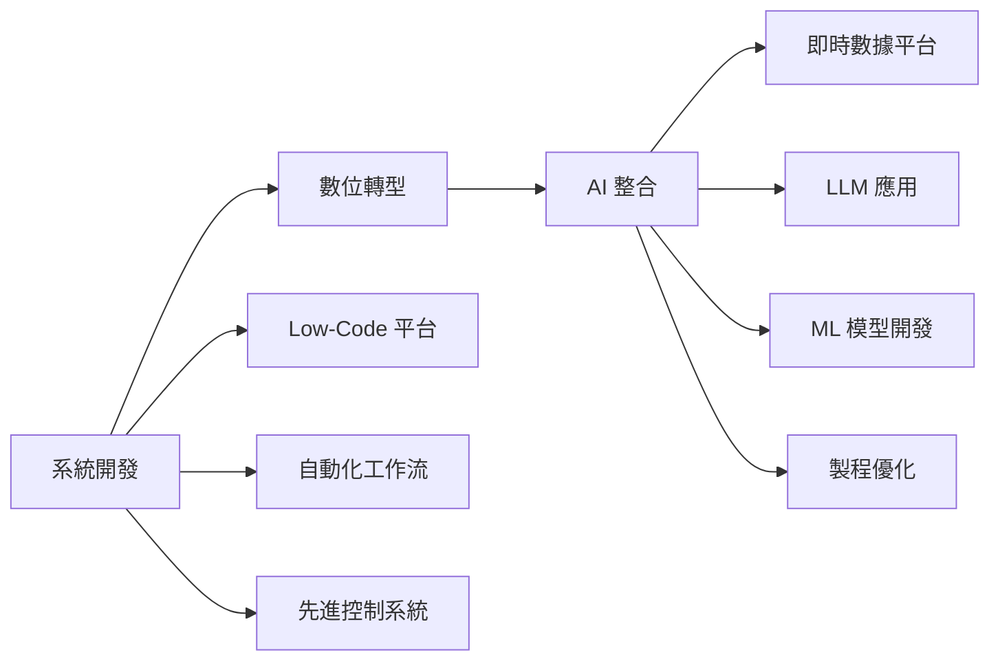
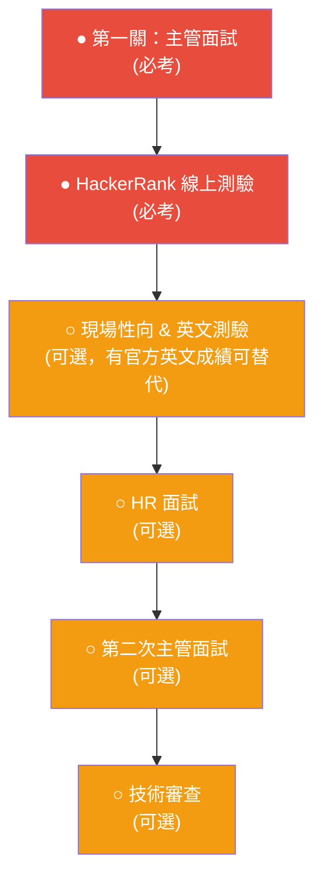

# TSMC 智慧製造中心 (IMC) 面試準備

## 一、部門概覽：智慧製造中心 (IMC)

IMC 是台積電的**核心製造大腦**，負責統管全球晶圓廠的製造、工程與自動化系統。核心使命是透過 ==AI、ML 與資訊技術==，將製造與工程專業知識整合為一套智慧製造平台。

> [!abstract] 一句話理解 IMC
> IMC = 用軟體與 AI 讓半導體工廠「自己思考、自己優化」的部門。

---

## 二、IMC 七大核心系統

### 1. 生產排程系統 (Production Scheduling System)

| 面向 | 說明 |
|------|------|
| **目標** | 最佳化生產流程 |
| **效益** | 提高設備利用率、縮短生產週期 (Cycle Time)、確保準時交貨 |
| **技術關鍵字** | 排程演算法、線性規劃、啟發式演算法、WIP 管理 |

> [!tip] 補充知識
> 半導體製造的排程極為複雜——一片晶圓可能需要經過 ==500+ 道製程==，涉及數百台機台。排程系統需要在設備稼動率、交期承諾、製程限制之間取得平衡。常見方法包括 **Dispatch Rule**（派工規則）、**Mixed Integer Programming**（混合整數規劃）等。

---

### 2. 先進製程與設備控制系統 (APC/AEC)

| 面向 | 說明 |
|------|------|
| **目標** | 奈米級精度的製程與設備控制 |
| **效益** | 確保晶片品質、即時異常偵測與診斷 |
| **技術關鍵字** | Run-to-Run Control (R2R)、SPC、FDC、即時監控 |

> [!tip] 補充知識
> - **APC (Advanced Process Control)**：根據前一批次的量測結果，自動調整下一批次的製程參數（如蝕刻深度、薄膜厚度），實現 Run-to-Run 控制。
> - **AEC (Advanced Equipment Control)**：監控設備健康狀態，偵測設備漂移 (drift) 與異常。
> - **FDC (Fault Detection and Classification)**：利用設備 sensor data 即時偵測故障並分類，是良率防線的重要一環。

---

### 3. 品質管控與防禦系統 (Quality Control & Defense)

| 面向 | 說明 |
|------|------|
| **目標** | 利用數據分析與 ML 提升產品品質 |
| **效益** | 交付高品質晶圓、降低客退率 |
| **技術關鍵字** | WAT、CP、異常偵測、Yield Analysis |

> [!tip] 補充知識
> 品質管控貫穿整個製程，從 **WAT (Wafer Acceptance Test)** 到 **CP (Circuit Probe)** 測試，每一站都可能產生大量數據。ML 模型可以在不良品流到下游之前提前攔截（這就是「防禦」的概念）。台積電的 **Virtual Metrology（虛擬量測）** 技術也是這個領域的重要應用。

---

### 4. 視覺 AI 應用 (Vision AI)

| 面向 | 說明 |
|------|------|
| **目標** | 影像辨識技術應用於半導體製程 |
| **效益** | 缺陷檢測、圖型辨識、自動化視覺檢查、良率提升、預測性維護 |
| **技術關鍵字** | CNN、Object Detection、Defect Classification、ADC |

> [!tip] 補充知識
> - **ADC (Automatic Defect Classification)**：自動將晶圓上的缺陷分類（如刮傷、粒子、圖案缺陷等）。
> - 傳統靠人工用顯微鏡判讀，現在用 Deep Learning（如 ResNet、YOLO 系列）大幅提升速度與準確率。
> - 台積電在此領域是業界領先者，擁有龐大的標記資料集。

---

### 5. 工作流程自動化 (Workflow Automation)

| 面向 | 說明 |
|------|------|
| **目標** | 流程自動化、減少人工作業 |
| **效益** | 提升營運效率、降低人為失誤 |
| **技術關鍵字** | RPA、Low-Code、BPM、自動化腳本 |

> [!tip] 補充知識
> 晶圓廠中有大量重複性工程師作業（如報表產出、異常通報、資料比對），透過 **RPA (Robotic Process Automation)** 與 **Low-Code 平台**（如 Power Automate、自建平台）實現自動化。JD 中特別提到 Low-Code 平台開發，這是 IMC 近年的重點方向。

---

### 6. 技術研發 (Technology R&D)

| 面向 | 說明 |
|------|------|
| **目標** | 開發前沿技術與方法論 |
| **效益** | 解決製造挑戰、驅動創新 |
| **技術關鍵字** | LLM、GenAI、新演算法、PoC |

> [!tip] 補充知識
> JD 特別提到 **LLM (Large Language Models)**，這代表台積電正在積極將生成式 AI 導入製造場景，例如：
> - 工程師智慧助手（用自然語言查詢製程資料）
> - 自動化報告生成
> - 知識庫問答系統
> - 異常原因分析的輔助建議

---

### 7. 運算基礎設施 (Computing Infrastructure)

| 面向 | 說明 |
|------|------|
| **目標** | 建構穩健、可擴展的系統架構 |
| **效益** | 支撐智慧製造、確保全球廠區無縫整合 |
| **技術關鍵字** | Cloud-Native、DevOps、CI/CD、Kubernetes、Microservices |

> [!tip] 補充知識
> 台積電的 IT 系統需要支撐 ==7×24 不間斷== 的晶圓廠運作。近年持續從傳統地端架構向 **Cloud-Native** 遷移，採用容器化 (Docker/K8s)、微服務架構。DevOps 文化也是 IMC 推動的重點。

---

## 三、職務責任拆解

### 核心工作內容

> [!important] 面試重點解讀
> 這個職位是一個 **「軟體工程 + AI/ML + 半導體製造域知識」** 的交叉角色。不是純軟體、不是純 AI，而是要能把技術落地到製造場景。

---

## 四、職務需求分析

### 學歷要求

| 層級 | 科系 | 備註 |
|------|------|------|
| **基本** | 碩士以上 | 資工、資管、工工、電機、機械、統計、應數、管科 |
| **加分** | 博士 | AI、資料科學、半導體相關研究 |

### 技術能力需求（重要度排序）

> [!warning] 必備技能
> - [ ] 至少精通一種程式語言（Python / SQL / C# / Java / React / TensorFlow）
> - [ ] 熟悉機器學習演算法
> - [ ] 資料視覺化能力
> - [ ] 統計分析方法
> - [ ] 系統開發生命週期 (SDLC)

> [!note] 加分技能
> - [ ] MLOps / AIOps 經驗
> - [ ] Web 開發（前後端，UI/UX）
> - [ ] 專案管理、需求分析、跨部門協作
> - [ ] Workflow Automation 工具
> - [ ] Low-Code 平台開發
> - [ ] Cloud-Native 技術（Docker、K8s、CI/CD）

### 個人特質

- 自我驅動、以結果為導向
- 樂於學習新技術
- 優秀的團隊合作與溝通能力
- 主動積極

---

## 五、面試流程

> [!danger] 必考項目
> 1. **主管面試**：準備自我介紹、技術問題、情境題
> 2. **HackerRank 測驗**：線上程式測試，建議刷題準備（演算法 + 資料結構）

> [!warning] 可選但要準備
> - **英文測驗**：若有 TOEIC / TOEFL / IELTS 成績單可替代
> - **HR 面試**：薪資期望、職涯規劃、為什麼選台積電
> - **技術審查**：可能需要展示過去專案或進行 live coding

---

## 六、工作地點

| 地點 | 主要廠區 |
|------|---------|
| 新竹 | 總部、研發中心 |
| 台中 | Fab 15（先進製程） |
| 台南 | Fab 18（最先進製程，3nm/2nm） |
| 高雄 | Fab 22/23（新建廠區） |
| 桃園 | 先進封裝 |

> [!info] 備註
> 最終工作地點會在面試過程中與主管討論決定。此職位可能需要==低頻次輪值 (On-call)==，具體細節可在面試中詢問主管。

---

## 七、面試準備建議

### 🎯 技術面準備

> [!example]- 1. 程式能力（HackerRank）
> - 刷 LeetCode Medium 等級題目，重點：Array、String、HashMap、DP、Graph
> - 熟練 Python 或你最擅長的語言
> - 練習在限時內寫出正確且效率好的程式碼
> - SQL 查詢也要準備（JOIN、GROUP BY、Window Function）

> [!example]- 2. ML / AI 知識
> - 能解釋常見演算法原理：Linear Regression、Decision Tree、Random Forest、SVM、Neural Network
> - 了解模型評估指標：Accuracy、Precision、Recall、F1-Score、AUC-ROC
> - 能說明 Overfitting / Underfitting 的處理方法
> - 加分：了解 LLM 的基本原理（Transformer、Attention、RAG）
> - 加分：了解 MLOps 概念（模型版本控制、自動化訓練、模型部署）

> [!example]- 3. 系統開發知識
> - 了解 SDLC（需求分析 → 設計 → 開發 → 測試 → 部署 → 維運）
> - 基本的系統架構概念：前後端分離、RESTful API、資料庫設計
> - 加分：Cloud-Native（Container、K8s、CI/CD Pipeline）
> - 加分：Low-Code 平台使用經驗

> [!example]- 4. 半導體製造基礎
> - 了解晶圓製造流程：薄膜沉積 → 光刻 → 蝕刻 → 摻雜 → CMP → 量測
> - 知道什麼是良率 (Yield)、Cycle Time、WIP
> - 了解 APC/AEC/FDC 的基本概念
> - 能說明 AI 如何應用在製造場景

### 💬 行為面試準備

> [!example]- 常見問題與準備方向
> 
> **自我介紹（中/英文各準備一版，2-3 分鐘）**
> - 學歷背景 → 技術專長 → 相關專案經驗 → 為什麼想加入台積電 IMC
> 
> **技術情境題**
> - 「請描述一個你用 ML 解決問題的專案經驗」
> - 「你如何處理一個大型資料集的前處理與特徵工程？」
> - 「遇到系統效能瓶頸時你會怎麼排查？」
> 
> **團隊合作題**
> - 「描述一次跨部門合作的經驗」
> - 「遇到意見分歧時你如何處理？」
> 
> **動機題**
> - 「為什麼選擇台積電？為什麼是 IMC？」
> - 「你對智慧製造的理解是什麼？」
> - 「你的短期/長期職涯規劃？」

### 📚 推薦準備資源

- **HackerRank 刷題**：[HackerRank](https://www.hackerrank.com/) / [LeetCode](https://leetcode.com/)
- **半導體製造基礎**：搜尋「半導體製程概論」、TSMC 官網技術文章
- **AI/ML 複習**：Andrew Ng 的 Machine Learning 課程筆記
- **台積電企業文化**：閱讀張忠謀自傳、台積電年報、ESG 報告

---

## 八、關鍵字速查表

| 縮寫 | 全稱 | 中文 |
|------|------|------|
| IMC | Intelligent Manufacturing Center | 智慧製造中心 |
| APC | Advanced Process Control | 先進製程控制 |
| AEC | Advanced Equipment Control | 先進設備控制 |
| FDC | Fault Detection and Classification | 故障偵測與分類 |
| SPC | Statistical Process Control | 統計製程管制 |
| R2R | Run-to-Run Control | 批次間控制 |
| WAT | Wafer Acceptance Test | 晶圓允收測試 |
| CP | Circuit Probe | 電路探針測試 |
| WIP | Work In Progress | 在製品 |
| CMP | Chemical Mechanical Polishing | 化學機械研磨 |
| ADC | Automatic Defect Classification | 自動缺陷分類 |
| SDLC | Software Development Life Cycle | 軟體開發生命週期 |
| MLOps | ML Operations | 機器學習維運 |
| RPA | Robotic Process Automation | 機器人流程自動化 |
| LLM | Large Language Model | 大型語言模型 |
| RAG | Retrieval-Augmented Generation | 檢索增強生成 |

---

> [!success] 面試心法
> 1. **展現學習力**：JD 明確歡迎應屆畢業生，重點不是「你現在會什麼」而是「你學得多快」
> 2. **連結技術與應用場景**：不要只講技術，要能說明「這個技術可以怎麼用在晶圓廠」
> 3. **準備具體案例**：每個技能都準備一個 STAR 故事（Situation → Task → Action → Result）
> 4. **展現主動性**：提問環節準備 2-3 個有深度的問題（如「IMC 目前最大的技術挑戰是什麼？」）
