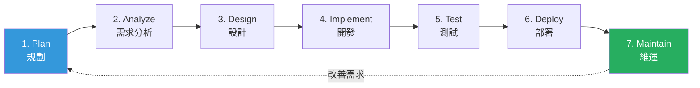
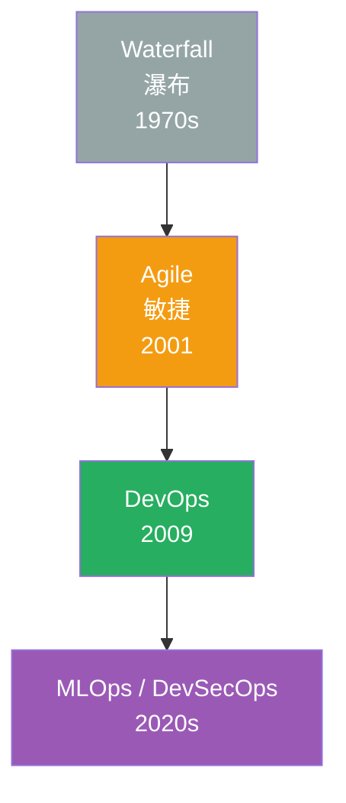
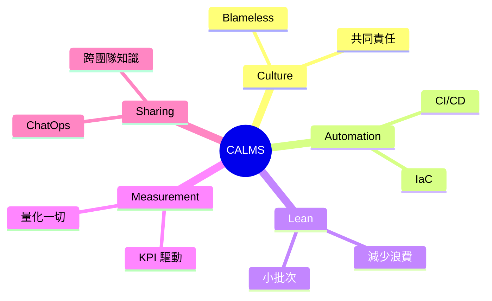
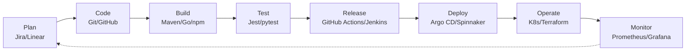
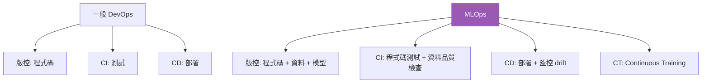
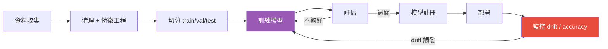
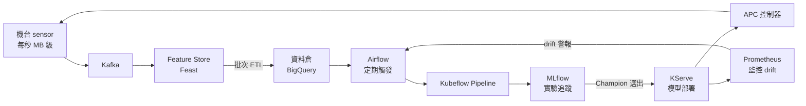

# DevOps 方法論與生命週期

> [!abstract] 一句話理解
> **SDLC** 是軟體從生到死的階段地圖；**DevOps** 是把 Dev 與 Ops 揉成一團的文化與實踐；**MLOps** 是 DevOps 套用到 ML 模型；**AIOps** 是用 AI 反過來幫 IT 維運。==這四個詞是「方法論層」，不是工具，但決定工具怎麼選==。

---

## 一、SDLC（Software Development Life Cycle）

### 1.1 七階段



| 階段 | 主要產出 | 角色 |
|------|---------|------|
| Plan | 商業需求、目標 | PM、Stakeholder |
| Analyze | 規格書、user story | BA、PM |
| Design | 架構圖、ER diagram、API spec | Architect |
| Implement | 程式碼 | Developer |
| Test | 測試報告 | QA |
| Deploy | 上線 | DevOps / Ops |
| Maintain | 改 bug、加功能 | Maintenance |

### 1.2 SDLC 的演進



| 模式 | 特徵 | 缺點 |
|------|------|------|
| **Waterfall** | 嚴格分階段、文件導向 | ==需求一變全部重來== |
| **Agile** | 短週期 (sprint)、可迭代 | Dev 和 Ops 還是分家 |
| **DevOps** | 整合 Dev + Ops、自動化 | 對 ML 不夠用 |
| **MLOps** | 加上資料、模型生命週期 | - |

---

## 二、DevOps

### 2.1 起源與定義

> "DevOps is a set of practices that combines software development (Dev) and IT operations (Ops) to shorten the systems development life cycle and provide continuous delivery with high software quality."

2009 年比利時 Velocity Conf 上 Patrick Debois 提出，2013 年《Phoenix Project》、2016 年《DevOps Handbook》是入門經典。

### 2.2 為什麼要 DevOps？

> [!warning] DevOps 之前的世界
> - **Dev** 拼命寫新功能，丟給 **Ops**
> - **Ops** 怕系統爆掉，能擋就擋
> - 上線排隊好幾個月、出事互相甩鍋
> - 每次部署 = 一場救火大戰

DevOps 的目標：==讓「軟體流動」更順暢==。

### 2.3 CALMS 五大支柱



| 字母 | 中文 | 重點 |
|------|------|------|
| **C** Culture | 文化 | Dev 和 Ops 是 ==同一個團隊==，共擔 KPI |
| **A** Automation | 自動化 | 重複事情都自動化（build / test / deploy） |
| **L** Lean | 精實 | 小批次、快速回饋、消除浪費 |
| **M** Measurement | 量化 | DORA 四指標、SLO、商業指標 |
| **S** Sharing | 分享 | 知識公開、跨團隊協作 |

### 2.4 DORA 四指標（量化 DevOps 表現）

DORA = DevOps Research and Assessment（Google 收購）。每年發《State of DevOps》報告。

| 指標 | 說明 | Elite 表現 | Low 表現 |
|------|------|-----------|---------|
| **Deployment Frequency** | 多常部署 | 每天 N 次 | 每月 < 1 次 |
| **Lead Time for Changes** | commit 到上線多久 | < 1 hour | > 6 個月 |
| **Change Failure Rate** | 部署失敗比例 | 0-15% | 46-60% |
| **Mean Time to Restore (MTTR)** | 出事後多久修復 | < 1 hour | > 1 個月 |

> [!tip] DORA 的洞見
> 高頻部署 ≠ 不穩定。==Elite 團隊「部署更頻繁」且「失敗率更低」==，因為小批次讓問題容易隔離與回滾。

### 2.5 DevOps 工具地景（簡圖）



### 2.6 DevSecOps（衍生概念）

把 ==Security== 提前到開發階段（"Shift Left"）：
- IDE 階段：SAST 靜態掃描
- CI 階段：依賴漏洞掃描 (Snyk / Trivy)
- Pre-deploy：Container image 掃描
- Runtime：RASP、policy as code (OPA)

---

## 三、MLOps

### 3.1 為什麼 ML 需要自己的 Ops？

> [!info] 與一般軟體的差別
> 一般軟體：==程式碼是唯一變數==，code 變才會壞。
> ML 系統：==程式碼 + 資料 + 模型 + 環境== 都是變數，任何一個變了結果都不同。



### 3.2 ML Pipeline



### 3.3 MLOps 三層成熟度（Google 定義）

| Level | 描述 | 特徵 |
|-------|------|------|
| **0** Manual | 手動腳本 | Jupyter Notebook 訓練、人工部署 |
| **1** Auto Pipeline | 自動化訓練 | 資料 → 訓練 → 部署 自動化 |
| **2** Auto CI/CD | 連 pipeline 本身都是 CI/CD | 改 pipeline code 自動 redeploy |

### 3.4 ML 系統的特殊挑戰

| 挑戰 | 說明 | 解法 |
|------|------|------|
| **Data Drift** | 線上資料分布跟訓練時不一樣 | 持續監控 + 自動重訓 |
| **Concept Drift** | 目標關係本身變了（如疫情前後消費行為） | 觸發式重訓 |
| **Model Decay** | 模型隨時間變差 | A/B test、shadow deployment |
| **Reproducibility** | 同一份 code 訓不出同一個模型 | 鎖定 random seed、版控資料、版控環境 |
| **Feedback Loop** | 模型影響資料、資料影響模型 | 隔離 train/serve、shadow scoring |

### 3.5 工具地景

| 類別 | 工具 |
|------|------|
| **實驗追蹤** | MLflow、Weights & Biases、Neptune |
| **資料版控** | DVC、LakeFS、Pachyderm |
| **特徵存儲** | Feast、Tecton |
| **Pipeline 編排** | Kubeflow、Airflow、Prefect、Dagster |
| **模型服務** | KServe、Seldon、BentoML、TorchServe |
| **監控** | Evidently、WhyLabs、Arize |
| **整合平台** | Vertex AI、SageMaker、Azure ML、Databricks |

### 3.6 一個典型 MLflow 範例

```python
import mlflow
from sklearn.ensemble import RandomForestClassifier
from sklearn.metrics import accuracy_score

mlflow.set_experiment("wafer-defect-classification")

with mlflow.start_run():
    # 記錄參數
    n_estimators = 100
    max_depth = 10
    mlflow.log_param("n_estimators", n_estimators)
    mlflow.log_param("max_depth", max_depth)
    
    # 訓練
    model = RandomForestClassifier(
        n_estimators=n_estimators,
        max_depth=max_depth,
    )
    model.fit(X_train, y_train)
    
    # 記錄指標
    acc = accuracy_score(y_test, model.predict(X_test))
    mlflow.log_metric("accuracy", acc)
    
    # 註冊模型
    mlflow.sklearn.log_model(
        model,
        "model",
        registered_model_name="wafer-defect-rf",
    )
```

---

## 四、AIOps

### 4.1 AIOps 是什麼？

> AIOps = AI for IT Operations

把 ML 應用在 ==IT 維運== 上，自動化處理告警、根因分析、容量預測。==是 SRE 的進化方向==。

### 4.2 典型應用

| 場景 | AIOps 做什麼 |
|------|-------------|
| **告警去重** | 相關性分析合併 1000 個告警為 1 個事件 |
| **異常偵測** | 學習正常 metric 模式，自動發現偏離 |
| **根因分析** | 跨多個服務追蹤異常傳播 |
| **容量預測** | 預測下季 K8s 需要多少 node |
| **自動修復** | 看到特定模式自動觸發 runbook |

### 4.3 AIOps vs MLOps

| | AIOps | MLOps |
|---|-------|-------|
| 對誰服務 | ==運維團隊== | ==資料科學家、產品== |
| 模型用來做什麼 | 維運自動化 | 業務功能 |
| 例子 | 自動關閉爆掉的 pod | 推薦商品、辨識缺陷 |

> [!tip] 一句話分辨
> ==MLOps 把 ML 模型當產品來經營，AIOps 把 ML 模型當維運工具來用==。

---

## 五、半導體 / IMC 場景應用

### 5.1 APC 模型的 MLOps 流水線

> [!example] 場景
> APC (Advanced Process Control) 模型根據前一批量測結果調整下一批參數。模型每 ==2 週== 要重訓。



### 5.2 Virtual Metrology (VM) 模型生命週期

VM = 用感測器 + ML 模型 「虛擬量測」一片晶圓的厚度等指標，==不用真的量==，省時間。

挑戰：
- 製程一改 → 模型立刻 drift
- 產品 mix 變化 → 多模型管理（不同產品不同模型）
- 台積電有 ==數萬個 VM 模型== 在線運作

MLOps 重點：
- ✅ 模型版本與 production 製程版本對齊
- ✅ 自動化重訓（每次製程變更觸發）
- ✅ Shadow deployment 比對新舊模型誤差
- ✅ 失效自動 fallback 到實際量測

### 5.3 AIOps 在晶圓廠 IT 的應用

| 場景 | AIOps 解法 |
|------|-----------|
| MES 告警太多 | 相關性分析合併 |
| 預測機台 server 容量 | 根據生產 ramp-up 計畫預測 |
| 機台 sensor 異常偵測 | 多變量 anomaly detection |
| 自動修復常見維運問題 | 識別特定 log pattern → 觸發 runbook |

### 5.4 SDLC 在 TSMC 的特殊性

> [!warning] 半導體業的限制
> - **資安要求極高**：code 不能上 public cloud
> - **變更稽核嚴格**：SOX、客戶 audit
> - **可靠度要求**：production 系統一掛 = 損失千萬
> 
> 因此 ==DevOps 落地會偏保守==：
> - 自建 GitLab / Artifactory（不走 GitHub）
> - Continuous Delivery 而非 Deployment（重要服務需審批）
> - 較重的 staging 與 release 流程

---

## 六、面試常考題

> [!question] Q1: DevOps 是工具還是文化？
> 
> **答題框架**：
> - ==文化先行，工具是輔助==
> - 沒有跨團隊協作的文化，買再貴的工具也是花錢買失敗
> - CALMS 五大支柱：Culture / Automation / Lean / Measurement / Sharing
> - 強調「Culture」放第一位

> [!question] Q2: MLOps 跟 DevOps 差別？
> 
> **答題框架**：
> 1. ML 系統有 ==三個變數==（code + data + model），DevOps 只管 code
> 2. 多了 Continuous Training（CT）
> 3. 監控不只是「服務健康」，還要監控 ==Data drift / Model drift==
> 4. 重現性挑戰大（隨機性）

> [!question] Q3: 如何衡量 DevOps 做得好不好？
> 
> **答題框架**：
> - 引用 ==DORA 四指標==：Deployment Frequency、Lead Time、Change Failure Rate、MTTR
> - 補充：商業指標也要看（NPS、Revenue Impact）
> - 強調量化文化是 DevOps 的核心

> [!question] Q4: Agile 和 DevOps 是同一回事嗎？
> 
> **答題框架**：
> - Agile 是 ==開發流程==（短 sprint、可迭代）
> - DevOps 是 ==交付流程==（從 commit 到上線到維運）
> - DevOps 是 Agile 往「Ops 端」的延伸

> [!question] Q5: 你會怎麼幫 IMC 的 ML 團隊建立 MLOps？
> 
> **答題框架**：
> 1. 先盤點：模型多少？目前怎麼訓練、怎麼上線？
> 2. 從 Level 0 → Level 1：第一步是 ==模型版本控制 + 實驗追蹤==（MLflow 或類似）
> 3. 第二步：自動化訓練 pipeline（Kubeflow / Airflow）
> 4. 第三步：監控 drift（Prometheus + Evidently）
> 5. 強調：==別一次做太多==，先解決最痛的點

---

## 七、面試前自我驗證清單

- [ ] 能背出 SDLC 七階段
- [ ] 能解釋 Waterfall / Agile / DevOps 演進
- [ ] 能說出 CALMS 五個字
- [ ] 能背 DORA 四指標
- [ ] 能解釋 ML pipeline 與一般 CI/CD 的差異
- [ ] 能舉出 3 個 MLOps 工具
- [ ] 能解釋 AIOps 跟 MLOps 差別

---

## 八、關鍵字速查表

| 縮寫 | 全稱 | 中文 |
|------|------|------|
| SDLC | Software Development Life Cycle | 軟體開發生命週期 |
| DevOps | Development + Operations | 開發 + 維運 |
| MLOps | ML Operations | 機器學習維運 |
| AIOps | AI for IT Operations | AI 維運 |
| DataOps | Data Operations | 資料維運 |
| DevSecOps | + Security | 安全內嵌的 DevOps |
| GitOps | - | 用 git 管 infra |
| CALMS | Culture/Automation/Lean/Measurement/Sharing | DevOps 五支柱 |
| DORA | DevOps Research and Assessment | Google 旗下研究組 |
| CI | Continuous Integration | 持續整合 |
| CD | Continuous Delivery / Deployment | 持續交付 / 部署 |
| CT | Continuous Training | 持續訓練（MLOps 概念）|
| Drift | - | 資料/模型/環境偏離 |
| Shift Left | - | 把問題提前到開發階段處理 |
| Toil | - | 重複性無價值維運 |

---

## 九、延伸閱讀

### Vault 內部
- [[雲原生與微服務架構]] ── DevOps 的技術載體
- [[IaC 與自動化部署]] ── 自動化的具體實作
- [[SRE 與可觀測性]] ── 量化 + 維運
- [[工具與資料分析]] ── ML 落地的工具
- [[TSMC IMC 面試準備]] ── 回到面試主題

### 外部資源
- [DORA State of DevOps Report](https://dora.dev/research/)
- [Google MLOps Whitepaper](https://cloud.google.com/resources/mlops-whitepaper)
- [The DevOps Handbook](https://itrevolution.com/product/the-devops-handbook-second-edition/)
- 書籍：《The Phoenix Project》《Accelerate》《Building Machine Learning Pipelines》

> [!success] 學習路徑建議
> 1. 先讀 ==《The Phoenix Project》==（小說形式講 DevOps，最容易入門）
> 2. 看 DORA Annual Report 了解業界水準
> 3. 動手做：寫一個 ML 模型 + MLflow 追蹤 + 簡單 pipeline
> 4. 把上面 1+2 結合：「為一個小 ML 服務做 MLOps L1」
