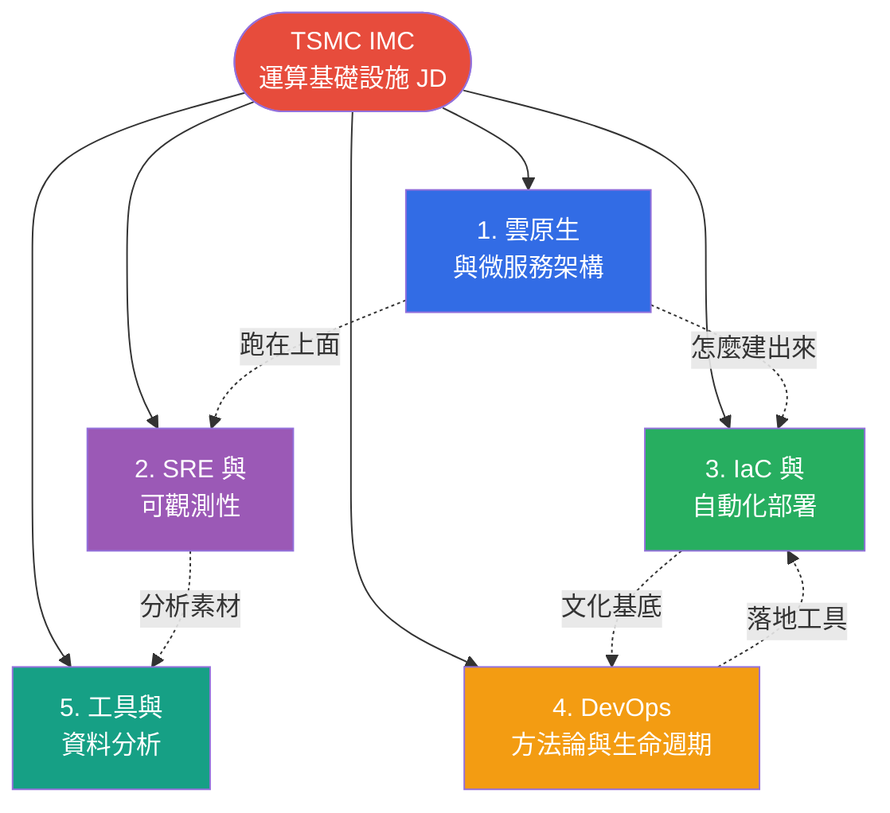

# IMC 技術領域 MOC

> [!abstract] 這是什麼？
> **MOC = Map of Content**，是這個技術領域的「總目錄」。
> 
> 本筆記彙整 [[TSMC IMC 面試準備]] JD 中要求的核心技術，按 ==5 大主題群組== 拆成獨立筆記，並建立彼此的關聯。從這裡可以快速跳到任一主題、看清整體脈絡。

---

## 一、整體地圖

---

## 二、五大主題導覽

### 🎯 [[雲原生與微服務架構]]
**涵蓋**：12-Factor App、Cloud-Native 五大支柱、Microservices vs Monolith、Container、==Kubernetes==、Helm、Service Mesh

> [!info] 一句話
> 系統怎麼設計才能在雲端「==自我成長、自我修復==」── 這篇是後面所有主題的「執行環境」。

**何時讀**：先讀。是基礎中的基礎。

---

### 🎯 [[SRE 與可觀測性]]
**涵蓋**：SRE 起源、==SLI / SLO / SLA / Error Budget==、四黃金信號、Observability 三支柱、Prometheus、Grafana、PromQL、LogQL

> [!info] 一句話
> 系統跑起來後，怎麼「==量化它有多可靠==」、怎麼看見它的內部狀態。

**何時讀**：寫過任何服務都該知道。

---

### 🎯 [[IaC 與自動化部署]]
**涵蓋**：Infrastructure as Code 哲學、宣告式 vs 命令式、==Terraform==、==Ansible==、CI/CD pipeline、部署策略（Blue-Green / Canary）、GitOps（Argo CD）

> [!info] 一句話
> 把「機器設定」當「==程式碼==」管：可版控、可重現、可回滾。

**何時讀**：要管理 ≥ 5 台機器或 ≥ 1 個雲端帳號時必修。

---

### 🎯 [[DevOps 方法論與生命週期]]
**涵蓋**：SDLC 七階段、Waterfall vs Agile vs DevOps、==CALMS==、==DORA 四指標==、MLOps、AIOps、DevSecOps

> [!info] 一句話
> 這篇是「==方法論==」── 工具會換，但「為什麼要這樣做」的思維不會。

**何時讀**：面試前必看。文化題、思維題的來源。

---

### 🎯 [[工具與資料分析]]
**涵蓋**：==Go 語言==（goroutine、channel、slog）、Log 分析（Loki、LogQL、jq）、==SAS==（DATA / PROC step、ANOVA、SPC）

> [!info] 一句話
> 具體的「==語言 + 工具==」── Go 是雲原生的母語，SAS 是台積電的 yield 老朋友。

**何時讀**：實作面試前、上班第一週用得到。

---

## 三、面試考點熱度

依照 [TSMC IMC 面試準備.md](../../TSMC%20IMC%20%E9%9D%A2%E8%A9%A6%E6%BA%96%E5%82%99.md) JD 重要性排序：

| 熱度 | 主題 | JD 對應 | 必須掌握程度 |
|-----|------|--------|-------------|
| 🔥🔥🔥 | [[DevOps 方法論與生命週期]] | SDLC、MLOps（明文要求）| ==必懂概念與名詞== |
| 🔥🔥🔥 | [[雲原生與微服務架構]] | Cloud-Native、K8s、Microservices | 能畫圖 + 寫 YAML |
| 🔥🔥 | [[SRE 與可觀測性]] | Prometheus / Grafana | 能寫簡單 PromQL |
| 🔥🔥 | [[IaC 與自動化部署]] | CI/CD、Ansible、Terraform | 能解釋差異 |
| 🔥 | [[工具與資料分析]] | Python / SQL / Go、SAS | Go 加分、Python 必備 |

---

## 四、橫向主題索引

### 4.1 「監控與量化」相關
- [[SRE 與可觀測性#二、SLI / SLO / SLA / Error Budget|SLI/SLO 定義]]
- [[SRE 與可觀測性#四、Prometheus 深入|Prometheus]]
- [[DevOps 方法論與生命週期#2.4 DORA 四指標（量化 DevOps 表現）|DORA 四指標]]
- [[工具與資料分析#二、Log 分析|Log 分析]]

### 4.2 「自動化與部署」相關
- [[IaC 與自動化部署#二、Terraform（Provisioning）|Terraform]]
- [[IaC 與自動化部署#三、Ansible（Configuration Management）|Ansible]]
- [[IaC 與自動化部署#四、CI/CD Workflows|CI/CD]]
- [[雲原生與微服務架構#五、Container Orchestration（容器編排）|K8s 編排]]

### 4.3 「ML / AI 落地」相關
- [[DevOps 方法論與生命週期#三、MLOps|MLOps 流水線]]
- [[DevOps 方法論與生命週期#四、AIOps|AIOps]]
- [[工具與資料分析#三、Statistical Analysis System (SAS)|SAS 與統計]]

### 4.4 「程式語言與工具」相關
- [[工具與資料分析#一、Go 語言|Go 語言]]
- [[雲原生與微服務架構#4.3 Dockerfile 範例（多階段建置）|Dockerfile]]
- [[SRE 與可觀測性#4.4 PromQL 範例|PromQL]]
- [[IaC 與自動化部署#2.3 HCL 語法範例|HCL (Terraform)]]
- [[IaC 與自動化部署#3.4 Playbook 範例|Ansible YAML]]

---

## 五、學習路徑建議

| 週次 | 主筆記 | 動手實作 |
|------|-------|---------|
| **W1** | [[DevOps 方法論與生命週期]] | 讀《Phoenix Project》前 100 頁 |
| **W2** | [[雲原生與微服務架構]] | minikube 跑一個 Deployment + Service |
| **W3** | [[SRE 與可觀測性]] | docker-compose 跑 Prom + Grafana，寫 1 個 alert |
| **W4** | [[IaC 與自動化部署]] | Terraform 開一台 EC2，Ansible 裝 nginx |
| **W5** | [[工具與資料分析]] | 用 Go 寫一個 log parser |
| **W6** | （複習）| 寫一份「我會什麼」的 cheat sheet 給面試官 |

---

## 六、面試 Cheat Sheet（速覽）

> [!success] 面試前最後 30 分鐘掃這個

### 必背名詞
- **Cloud-Native 5 支柱**：Container / Microservices / CI/CD / DevOps / API-driven
- **12-Factor 重點**：Config in env、Stateless、Logs to stdout、Build/Release/Run 分離
- **K8s 核心物件**：Pod / Deployment / Service / Ingress / ConfigMap / Secret
- **SLI/SLO/SLA**：量到的 / 內部目標 / 對外合約
- **四黃金信號**：Latency / Traffic / Errors / Saturation
- **CALMS**：Culture / Automation / Lean / Measurement / Sharing
- **DORA**：Deployment Frequency / Lead Time / Change Failure Rate / MTTR
- **Terraform vs Ansible**：建資源 vs 設定機器

### 必會回答
- 為什麼要用 cloud-native？
- 微服務的代價是什麼？
- 為什麼可靠度不要追求 100%？
- DevOps 是工具還是文化？
- MLOps 跟 DevOps 差別？

### 必能舉例
- 至少一個 ==IMC 場景== 的具體應用（FDC dashboard / APC MLOps / 跨 Fab K8s）
- 至少一段 ==程式碼或設定==（YAML / PromQL / Go / Terraform）

---

## 七、回到面試主題

⤴️ [[TSMC IMC 面試準備]] ── 回到 IMC 面試準備總頁

> [!tip] 使用建議
> 1. 把這份 MOC 釘在 Obsidian 的 ==Pinned tab==
> 2. 學完一篇就在對應筆記的 frontmatter 把 `status` 從 `整理中` 改為 `已掌握`
> 3. 面試前用「面試 Cheat Sheet」做最後檢核
