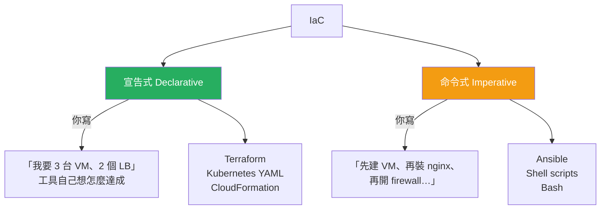
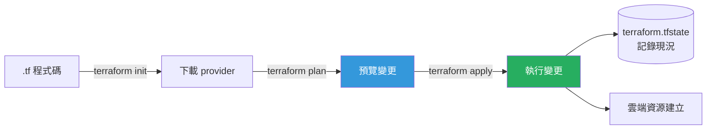
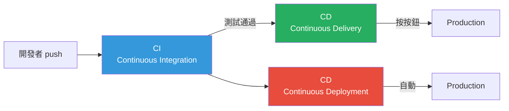
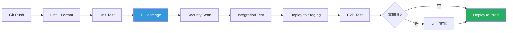
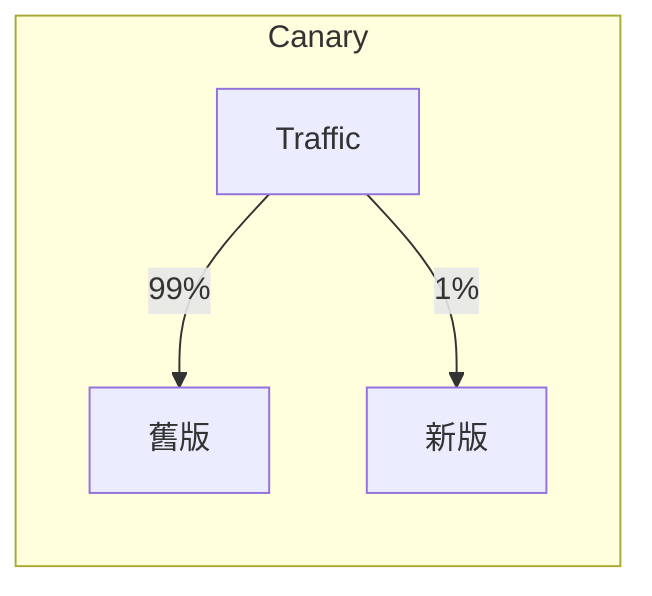
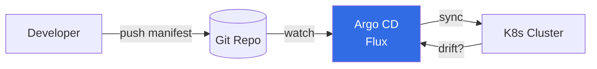

# IaC 與自動化部署

> [!abstract] 一句話理解
> **IaC (Infrastructure as Code)** 是把「機器、網路、雲端資源」用 ==程式碼== 描述、版控、自動建構的方法。==Terraform 管「資源建立」、Ansible 管「機器設定」、CI/CD 把它們串起來==，讓基礎設施像軟體一樣可重現、可審閱、可回滾。

---

## 一、Infrastructure as Code（IaC）

### 1.1 為什麼需要 IaC？

> [!warning] 沒有 IaC 的世界
> - 工程師 A 手動在 console 點了 50 個按鈕建出環境
> - 半年後測試環境壞了沒人知道哪裡被改過
> - 新人想複製一份「跟正式環境一樣」的環境，要花一週土法煉鋼
> - 沒有 audit log，誰改了什麼一團糊塗

IaC 把基礎設施 ==版本化、可重現、可審閱==。一份程式碼能拉出 100 份完全一樣的環境。

### 1.2 IaC 兩大派別：宣告式 vs 命令式



| 比較 | 宣告式 | 命令式 |
|------|--------|--------|
| 你描述 | 「最終狀態」 | 「執行步驟」 |
| 重跑安全？ | ==是 (idempotent)== | 看你怎麼寫 |
| 推理難度 | 低（看終態） | 高（看流程） |
| 代表 | Terraform, K8s | Ansible, 純 shell |

### 1.3 Mutable vs Immutable Infrastructure

| | Mutable（可變） | Immutable（不可變） |
|---|--------|--------|
| 升級方式 | SSH 進去改 | ==丟掉舊的、開全新的== |
| 一致性 | 容易飄移 (drift) | 完全一致 |
| 問題排查 | 「上次改了什麼？」 | 看程式碼即知 |
| 代表技術 | Ansible 在現有機器 patch | Container、Packer 製作 AMI |

> [!tip] 業界趨勢
> 雲原生時代偏好 ==Immutable Infrastructure==。Container 就是這個哲學的極致：每次 release = 重新打包 image，不在 production 上熱修改。

---

## 二、Terraform（Provisioning）

### 2.1 Terraform 是什麼？

HashiCorp 出品，是 ==雲端資源 provisioning== 的事實標準。
- **宣告式** (HCL 語法)
- **多雲支援**：AWS、Azure、GCP、VMware、K8s 都有 provider
- **State driven**：用 state file 追蹤「我管理了哪些資源」
- **執行計畫 (plan)**：先預覽變更再 apply，避免悲劇

### 2.2 核心概念



### 2.3 HCL 語法範例

```hcl
# main.tf ── 建立一台 AWS EC2
terraform {
  required_providers {
    aws = {
      source  = "hashicorp/aws"
      version = "~> 5.0"
    }
  }
  backend "s3" {
    bucket = "tsmc-imc-terraform-state"
    key    = "fab15/prod/terraform.tfstate"
    region = "us-west-2"
  }
}

provider "aws" {
  region = var.aws_region
}

variable "aws_region" {
  type    = string
  default = "us-west-2"
}

variable "instance_count" {
  type    = number
  default = 3
}

resource "aws_instance" "tool_monitor" {
  count         = var.instance_count
  ami           = "ami-0c55b159cbfafe1f0"
  instance_type = "t3.medium"

  tags = {
    Name        = "tool-monitor-${count.index}"
    Environment = "production"
    Fab         = "F15"
    ManagedBy   = "terraform"
  }
}

output "instance_ips" {
  value = aws_instance.tool_monitor[*].private_ip
}
```

### 2.4 工作流程

```bash
terraform init      # 初始化、下載 provider
terraform fmt       # 格式化
terraform validate  # 語法檢查
terraform plan      # 預覽變更（重要！上線前必跑）
terraform apply     # 真的執行
terraform destroy   # 拆掉所有資源
```

### 2.5 Module（重用單位）

```hcl
# 用別人寫好的 module
module "vpc" {
  source  = "terraform-aws-modules/vpc/aws"
  version = "5.0.0"

  name = "imc-fab15-vpc"
  cidr = "10.0.0.0/16"

  azs             = ["us-west-2a", "us-west-2b"]
  private_subnets = ["10.0.1.0/24", "10.0.2.0/24"]
  public_subnets  = ["10.0.101.0/24", "10.0.102.0/24"]
}
```

> [!tip] State 管理是命脈
> **絕對不要** 把 `.tfstate` commit 到 git。它包含敏感資訊，且需要 lock 機制防止多人同時 apply。**遠端後端 (S3 + DynamoDB / Terraform Cloud) 是必備**。

---

## 三、Ansible（Configuration Management）

### 3.1 Ansible 是什麼？

Red Hat 出品，==agentless==（不用在目標機器裝任何東西，只要 SSH），用 YAML 寫 playbook，==適合「在現有機器上做事」==。

| 比較 | Terraform | Ansible |
|------|-----------|---------|
| 主要任務 | 建資源（雲端 VM、網路） | 設定機器（裝套件、改設定） |
| 風格 | 宣告式 | 命令式（但模組是 idempotent） |
| 狀態管理 | tfstate 追蹤 | 不追蹤狀態 |
| 通訊 | API 呼叫雲端 | SSH 登入機器 |

> [!tip] 經典分工
> ==Terraform 把機器叫出來，Ansible 把機器設定好==。組合使用是業界常見模式。

### 3.2 核心物件

| 物件 | 說明 |
|------|------|
| **Inventory** | 目標機器清單 |
| **Playbook** | 要做的事（YAML） |
| **Task** | playbook 中的一步 |
| **Module** | task 用的工具（如 `apt`、`copy`、`service`） |
| **Role** | 可重用的 task 集合 |
| **Handler** | 觸發式 task（如「設定改了就重啟服務」） |

### 3.3 Inventory 範例

```ini
# inventory/fab15.ini
[fab15_tools]
tool-001 ansible_host=10.15.1.1
tool-002 ansible_host=10.15.1.2
tool-003 ansible_host=10.15.1.3

[fab15_servers]
server-mes-01 ansible_host=10.15.0.10
server-fdc-01 ansible_host=10.15.0.20

[fab15:children]
fab15_tools
fab15_servers

[fab15:vars]
ansible_user=imc-deploy
ansible_ssh_private_key_file=~/.ssh/imc_rsa
```

### 3.4 Playbook 範例

```yaml
# deploy-prometheus-exporter.yml
- name: Deploy Prometheus node exporter to all fab15 servers
  hosts: fab15_servers
  become: yes
  vars:
    exporter_version: "1.7.0"
    exporter_port: 9100

  tasks:
    - name: Create exporter user
      user:
        name: node_exporter
        system: yes
        shell: /sbin/nologin

    - name: Download node_exporter
      get_url:
        url: "https://github.com/prometheus/node_exporter/releases/download/v{{ exporter_version }}/node_exporter-{{ exporter_version }}.linux-amd64.tar.gz"
        dest: /tmp/node_exporter.tar.gz
        checksum: "sha256:abc123..."

    - name: Extract node_exporter
      unarchive:
        src: /tmp/node_exporter.tar.gz
        dest: /usr/local/bin/
        remote_src: yes
        extra_opts: ["--strip-components=1"]
        creates: /usr/local/bin/node_exporter

    - name: Install systemd service
      copy:
        dest: /etc/systemd/system/node_exporter.service
        content: |
          [Unit]
          Description=Prometheus Node Exporter
          After=network.target

          [Service]
          User=node_exporter
          ExecStart=/usr/local/bin/node_exporter --web.listen-address=:{{ exporter_port }}
          Restart=always

          [Install]
          WantedBy=multi-user.target
      notify: restart node_exporter

    - name: Enable & start service
      systemd:
        name: node_exporter
        enabled: yes
        state: started
        daemon_reload: yes

  handlers:
    - name: restart node_exporter
      systemd:
        name: node_exporter
        state: restarted
```

執行：

```bash
ansible-playbook -i inventory/fab15.ini deploy-prometheus-exporter.yml
```

### 3.5 Idempotency（冪等性）

> 跑 1 次跟跑 100 次的結果應該相同。

Ansible 的 module 大多是 idempotent 的：
- `package: state=present` ── 已裝就不動，沒裝才裝
- `file: state=directory` ── 已存在就不動
- `lineinfile` ── 該行存在就不重複加

==這是 IaC 的核心特性==，沒有 idempotency 就不能放心重跑。

---

## 四、CI/CD Workflows

### 4.1 CI vs CD vs CD



| 階段 | 全名 | 做什麼 |
|------|------|--------|
| **CI** | Continuous Integration | 每次 push 自動 build + test |
| **CD** | Continuous Delivery | 自動產生 release，等人按按鈕上線 |
| **CD** | Continuous Deployment | ==每個 commit 自動上 production== |

> [!warning] CD 不是 CD
> 同樣縮寫但含義不同。Delivery = 隨時可上、需人觸發；Deployment = 自動上線到底。對嚴謹環境（金融、半導體），通常是 ==Continuous Delivery==。

### 4.2 一個典型 Pipeline



### 4.3 GitHub Actions 範例

```yaml
# .github/workflows/ci-cd.yml
name: IMC Tool Monitor CI/CD

on:
  push:
    branches: [main, develop]
  pull_request:
    branches: [main]

jobs:
  test:
    runs-on: ubuntu-latest
    steps:
      - uses: actions/checkout@v4
      - name: Set up Go
        uses: actions/setup-go@v5
        with:
          go-version: '1.22'
      - name: Run tests
        run: |
          go vet ./...
          go test -race -coverprofile=coverage.out ./...
      - name: Upload coverage
        uses: codecov/codecov-action@v4

  build:
    needs: test
    runs-on: ubuntu-latest
    steps:
      - uses: actions/checkout@v4
      - name: Build Docker image
        run: |
          docker build -t registry.tsmc.com/imc/tool-monitor:${{ github.sha }} .
      - name: Trivy scan
        uses: aquasecurity/trivy-action@master
        with:
          image-ref: 'registry.tsmc.com/imc/tool-monitor:${{ github.sha }}'
          severity: 'CRITICAL,HIGH'
          exit-code: '1'
      - name: Push image
        run: |
          docker push registry.tsmc.com/imc/tool-monitor:${{ github.sha }}

  deploy-staging:
    needs: build
    if: github.ref == 'refs/heads/develop'
    runs-on: ubuntu-latest
    steps:
      - name: Deploy to staging K8s
        run: |
          kubectl set image deployment/tool-monitor \
            monitor=registry.tsmc.com/imc/tool-monitor:${{ github.sha }} \
            -n imc-staging

  deploy-prod:
    needs: build
    if: github.ref == 'refs/heads/main'
    environment: production
    runs-on: ubuntu-latest
    steps:
      - name: Deploy to production K8s
        run: |
          kubectl set image deployment/tool-monitor \
            monitor=registry.tsmc.com/imc/tool-monitor:${{ github.sha }} \
            -n imc-prod
```

### 4.4 部署策略

| 策略 | 說明 | 風險 |
|------|------|------|
| **Recreate** | 砍掉重來 | 有停機 |
| **Rolling Update** | 一批一批換 | 中等，有版本混雜期 |
| **Blue-Green** | 兩套並存，瞬間切換 | 低，但 ==雙倍資源== |
| **Canary** | 1% → 10% → 50% → 100% | 最低，可早期發現問題 |



### 4.5 GitOps（CD 的進階模式）

> "Git 是真理之源" ── 所有環境的 desired state 都在 git，工具自動把實際狀態 reconcile 過去。



優勢：
- **Audit log 天然存在**（git history）
- **回滾 = git revert**
- **Pull-based 部署**：cluster 主動拉、不用對外開 API

---

## 五、半導體 / IMC 場景應用

### 5.1 跨廠區大量機台的設定一致性

> [!example] 場景
> 全球 8 座 Fab，每座 200 台機台 server，每台都要裝 Prometheus exporter + 對應的 sensor agent + ssh key。
> 
> **沒有 IaC**：手動 SSH 進去 1600 台，改一次 config 要 2 週、且各廠版本飄移。
> 
> **有 IaC**：
> 1. Ansible inventory 自動從 CMDB 同步機台清單
> 2. 一份 playbook 同步部署到所有廠
> 3. 跑 ==`ansible -m setup` 收集現況== 確認一致

### 5.2 新 Fab 上線環境快速複製

> [!example] 場景
> 高雄 Fab 22 新建，要快速建出跟 Fab 18 一樣的智慧製造平台。
> 
> 1. **Terraform module**：複製 Fab 18 的 module，改幾個變數（區域、子網段、容量）即可生出整套網路、儲存、K8s
> 2. **Helm + Argo CD**：把 IMC 的 50+ 服務同步到新 cluster
> 3. **Ansible**：把機台 server 設定一次到位
> 
> 從 6 個月縮短到 2 週。

### 5.3 變更管理與稽核

半導體業對 ==SOX、ISO、客戶稽核== 都有變更管理要求。IaC + GitOps 天然提供：
- 誰、何時、改了什麼（git blame）
- Code review 強制 4 眼原則
- 回滾流程清楚 (revert + redeploy)

### 5.4 災備（DR）


主站掛了，DR 站從同一份 git 拉設定，==分鐘等級== 就能接管。

---

## 六、面試常考題

> [!question] Q1: 為什麼需要 IaC？口頭沒寫過怎麼解釋？
> 
> **答題框架**：
> 1. 環境一致性（dev/staging/prod 一份 code）
> 2. 可重現（new fab 快速複製）
> 3. 可審閱（PR review、git history）
> 4. 可回滾（壞了 revert）
> 5. 速度（手動 vs 自動）

> [!question] Q2: Terraform 和 Ansible 的差別與何時用？
> 
> **答題框架**：
> - Terraform：宣告式，==建資源==（雲端 VM、網路、DB）
> - Ansible：命令式，==設定機器==（裝軟體、改 config）
> - 經典組合：Terraform 把機器叫出來 → Ansible 把機器設定好
> - 加分：提 ==Pulumi==（用 Python/Go 寫 IaC）和 ==Crossplane==（K8s 原生 IaC）

> [!question] Q3: 描述一個 CI/CD pipeline 的完整流程
> 
> **答題框架**：
> Push → Lint → Unit Test → Build → Security Scan → Integration Test → Deploy Staging → E2E → 審批 → Deploy Prod
> 
> 加分：說明每階段的「失敗門檻」，例如 ==coverage < 80% 阻擋 merge==

> [!question] Q4: 你會怎麼設計藍綠部署？對比 canary？
> 
> **答題框架**：
> - **Blue-Green**：完整新環境，DNS / LB 一刀切換，==缺點是雙倍資源==
> - **Canary**：流量比例漸進切換，==缺點是要好的監控判斷何時推進==
> - 半導體場景：核心服務用 canary（風險低），離線批次用 blue-green（簡單）

> [!question] Q5: Terraform state 為什麼重要？
> 
> **答題框架**：
> 1. 它是「我管了哪些資源」的真理
> 2. 不能 commit 到 git（含密碼）
> 3. 多人協作需 ==遠端 state + lock==（S3 + DynamoDB / Terraform Cloud）
> 4. State drift（手動改了 console）會導致 plan 出現意外差異

---

## 七、面試前自我驗證清單

- [ ] 能 30 秒解釋 IaC 的價值
- [ ] 能說出 Terraform vs Ansible 的分工
- [ ] 能寫出 Terraform 建一個 EC2 的 HCL
- [ ] 能寫出 Ansible playbook 裝一個 service
- [ ] 能畫出典型 CI/CD pipeline
- [ ] 能說出 4 種部署策略並比較
- [ ] 能解釋 GitOps 與傳統 CD 的差異

---

## 八、關鍵字速查表

| 縮寫 / 名詞 | 全稱 | 中文 |
|-----------|------|------|
| IaC | Infrastructure as Code | 基礎設施即程式碼 |
| HCL | HashiCorp Configuration Language | Terraform 的語法 |
| CI | Continuous Integration | 持續整合 |
| CD | Continuous Delivery / Deployment | 持續交付 / 部署 |
| GitOps | - | 用 git 管理 infra 的方法論 |
| Idempotent | - | 冪等的（重跑結果一樣） |
| Drift | - | 實際狀態與 IaC 描述偏離 |
| AMI | Amazon Machine Image | AWS 的機器映像 |
| Ansible Inventory | - | Ansible 的目標機器清單 |
| Playbook | - | Ansible 的腳本 |
| Role | - | Ansible 可重用的 task 集合 |
| Argo CD | - | K8s 的 GitOps 工具 |
| Flux | - | 另一個 GitOps 工具 |
| Pulumi | - | 用一般語言寫 IaC |
| Crossplane | - | K8s 原生的雲端資源管理 |

---

## 九、延伸閱讀

### Vault 內部
- [[雲原生與微服務架構]] ── 部署的目標環境
- [[SRE 與可觀測性]] ── 部署完要監控
- [[DevOps 方法論與生命週期]] ── 流程文化面
- [[TSMC IMC 面試準備]] ── 回到面試主題

### 外部資源
- [Terraform 官方文件](https://developer.hashicorp.com/terraform/docs)
- [Ansible 官方文件](https://docs.ansible.com/)
- [GitHub Actions 文件](https://docs.github.com/en/actions)
- [Argo CD 文件](https://argo-cd.readthedocs.io/)
- 書籍：《Terraform: Up & Running》《Ansible for DevOps》

> [!success] 學習路徑建議
> 1. 用 Terraform 在 AWS / Azure 免費額度上開一台 VM
> 2. 用 Ansible 在那台 VM 上裝 nginx
> 3. 寫一個 GitHub Actions workflow build + push image
> 4. 用 Argo CD 把 image 同步到 K8s
