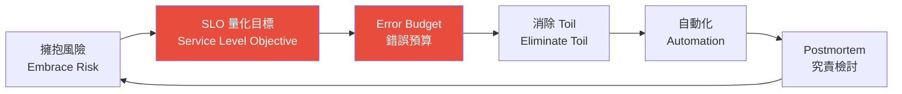
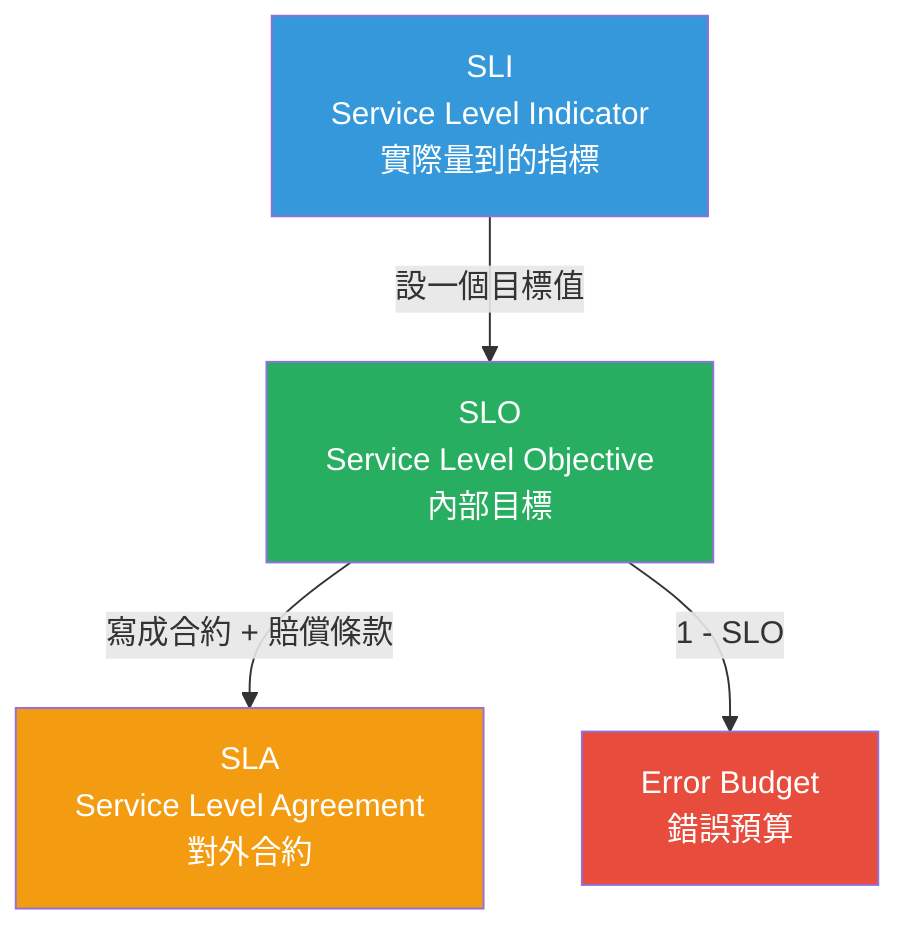
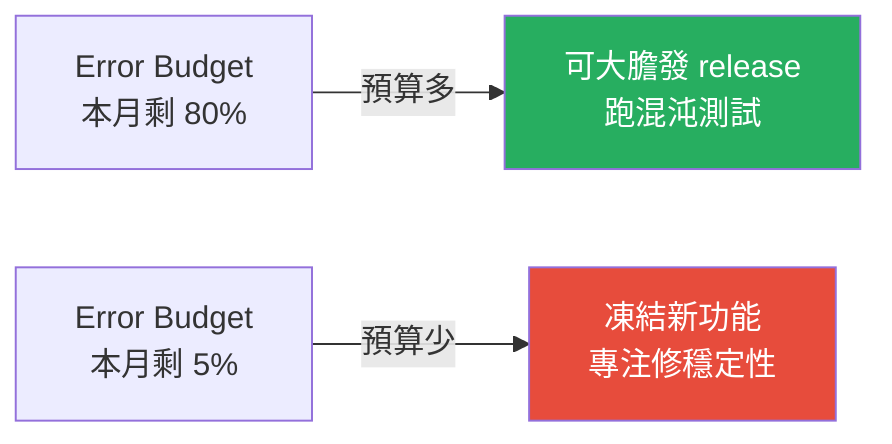
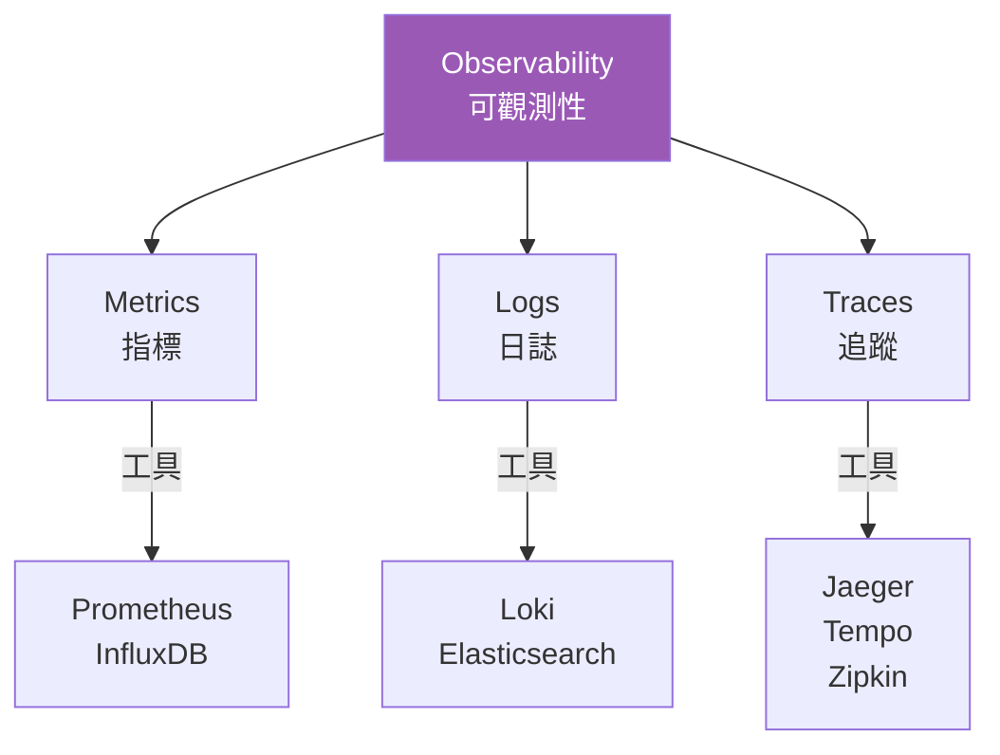
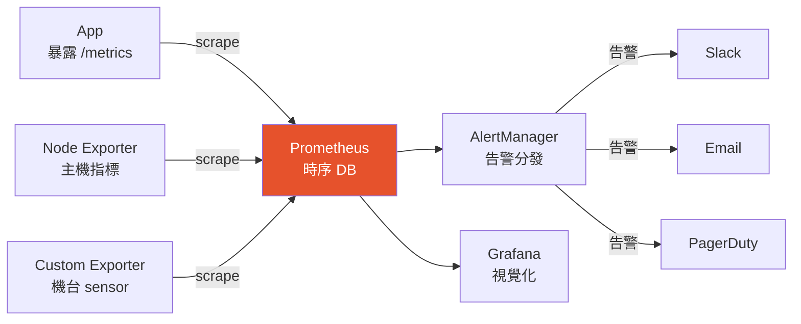

# SRE 與可觀測性

> [!abstract] 一句話理解
> **SRE (Site Reliability Engineering)** 是 Google 提出的「==用軟體工程方法做維運==」的學科，核心是用 SLI/SLO 量化可靠度、用 Error Budget 平衡功能與穩定性。**可觀測性 (Observability)** 則是 SRE 的眼睛 ── 透過 Metrics、Logs、Traces 三支柱，讓分散式系統「自己說話」。

---

## 一、SRE 是什麼？

### 1.1 起源與定義

> "SRE is what you get when you treat operations as if it's a software problem." ── Ben Treynor, Google

2003 年 Google 副總裁 Ben Treynor 創立 SRE 團隊，要求成員至少 50% 是工程師。書籍《Site Reliability Engineering》（Google SRE Book，免費線上版）把這套方法論推向全業界。

### 1.2 SRE vs DevOps vs 傳統 Ops

| 面向 | 傳統 Ops | DevOps | SRE |
|------|---------|--------|-----|
| **誰做維運？** | 專職維運團隊 | Dev + Ops 合作 | 軟體工程師做維運 |
| **可靠度方法** | 經驗、值班 | 自動化 pipeline | ==量化 SLO + Error Budget== |
| **目標** | 100% 可用 | 快速交付 | 在「夠可靠」與「快速演進」間找平衡 |
| **核心產出** | 救火 | CI/CD pipeline | Toil 自動化、SLO 制度、Postmortem |

> [!tip] 一句話分辨
> ==DevOps 是文化，SRE 是 DevOps 的具體實作==。SRE 用工程方法回答「我們應該多可靠？」這個問題。

### 1.3 SRE 的核心原則



| 原則 | 說明 |
|------|------|
| **擁抱風險** | 100% 可用既不可能也不必要，==過度可靠是浪費== |
| **量化 SLO** | 對「夠可靠」訂出可量測的目標 |
| **Error Budget** | (1 − SLO) 的時間是「允許出錯」的預算，可拿來做新功能上線 |
| **消除 Toil** | 重複、可自動化、無價值產出的工作要消滅 |
| **自動化** | 維運工作要寫成程式 |
| **Blameless Postmortem** | 事故後做不究責個人的根因分析 |

---

## 二、SLI / SLO / SLA / Error Budget

> [!important] 這四個詞最常被混淆，面試必考

### 2.1 定義



| 名詞 | 中文 | 定義 | 例子 |
|------|------|------|------|
| **SLI** | 服務等級指標 | 你「實際量到」的數字 | 過去 30 天可用率 = 99.97% |
| **SLO** | 服務等級目標 | 你「希望達到」的內部目標 | 30 天內可用率 ==≥ 99.95%== |
| **SLA** | 服務等級協議 | 對外合約，違反要 ==賠錢== | 月可用率 < 99.9% 客戶 5% 退費 |
| **Error Budget** | 錯誤預算 | 允許「不達標」的時間/額度 | 99.95% SLO → 每月 21.6 分鐘可掛 |

### 2.2 Error Budget 速查表

| SLO | 月停機允許 | 年停機允許 |
|-----|-----------|-----------|
| 99% | 7h 12m | 3.65 天 |
| 99.9% (3個 9) | 43m 12s | 8h 45m |
| 99.95% | 21m 36s | 4h 22m |
| **99.99% (4個 9)** | **4m 19s** | **52m 35s** |
| 99.999% (5個 9) | 26s | 5m 15s |

> [!warning] 多一個 9 成本是十倍
> 99.9 → 99.99 不是「再努力一點」，而是 ==整套架構升級==（多區、自動 failover、混沌測試…）。對應到 IMC，==機台監控系統 99.9% 就夠==，反倒是核心生產系統 (MES) 才需要 99.99%。

### 2.3 怎麼選 SLI？四黃金信號 (Four Golden Signals)

Google SRE 書推薦的四個基礎 SLI：

| 信號 | 中文 | 量什麼 | 範例 PromQL |
|------|------|--------|-------------|
| **Latency** | 延遲 | 請求多久回應 | `histogram_quantile(0.99, http_duration)` |
| **Traffic** | 流量 | 單位時間請求數 | `rate(http_requests_total[1m])` |
| **Errors** | 錯誤率 | 失敗請求佔比 | `rate(http_requests{code=~"5.."}[1m])` |
| **Saturation** | 飽和度 | 系統資源剩多少 | `node_memory_usage / node_memory_total` |

延伸：USE method (Utilization / Saturation / Errors，給資源用) 與 RED method (Rate / Errors / Duration，給服務用)。

### 2.4 Error Budget 的政策應用



> [!example] Error Budget Policy 的真實效力
> Google 的 SRE 與 Dev 簽 ==契約==：Error Budget 燒完，新功能立刻凍結，全力修 bug。這制度逼產品團隊把「可靠度」當第一優先級。

---

## 三、可觀測性的三支柱



| 支柱 | 形式 | 適合場景 | 代表工具 |
|------|------|---------|---------|
| **Metrics** | 數字、時序資料 | 趨勢、告警、儀表板 | Prometheus、InfluxDB |
| **Logs** | 文字事件 | 除錯、稽核、查根因 | Loki、ELK |
| **Traces** | 跨服務呼叫鏈 | 找瓶頸、找出哪段慢 | Jaeger、Tempo、OpenTelemetry |

> [!tip] Observability vs Monitoring
> - **Monitoring**：你「事先知道要量什麼」（CPU、QPS）
> - **Observability**：系統的內部狀態能從外部 ==推斷== ── 出現未知問題時還能查
> 
> 簡單說：Monitoring 答「健不健康」，Observability 答「為什麼不健康」。

---

## 四、Prometheus 深入

### 4.1 為什麼 Prometheus 成為業界標準？

- **Pull-based**：Prometheus 主動去 scrape 各服務，不是服務主動 push
- **多維度標籤** (labels)：靈活查詢
- **內建 PromQL**：強大的時序查詢語言
- **CNCF 第二個畢業專案**（K8s 之後）

### 4.2 架構



### 4.3 資料模型

每筆 metric 由「name + labels + value + timestamp」組成：

```
http_requests_total{method="POST", endpoint="/api/wafer", status="200"} 1234 @1715200000
└── metric name           └─────────── labels ───────────┘  └─value ─┘
```

四種 metric type：

| Type | 用途 | 例子 |
|------|------|------|
| **Counter** | 只增不減 | 請求總數、錯誤總數 |
| **Gauge** | 可上下變動 | 記憶體使用、機台溫度 |
| **Histogram** | 分佈統計 | 請求延遲分布 |
| **Summary** | 客戶端計算的分位數 | 直接給 P50/P95/P99 |

### 4.4 PromQL 範例

```promql
# 1. 過去 5 分鐘 5xx 錯誤率
sum(rate(http_requests_total{status=~"5.."}[5m]))
  /
sum(rate(http_requests_total[5m]))

# 2. 99 分位延遲
histogram_quantile(0.99,
  sum(rate(http_duration_seconds_bucket[5m])) by (le)
)

# 3. CPU 使用率（主機指標）
100 - (avg by (instance) (
  rate(node_cpu_seconds_total{mode="idle"}[5m])
) * 100)

# 4. 機台稼動率 (OEE 中的 Availability)
sum(rate(tool_uptime_seconds_total[1h])) by (tool_id)
  /
sum(rate(tool_total_seconds_total[1h])) by (tool_id)

# 5. 過去 30 天 SLO：99.95% 可用率
1 - (
  sum(rate(http_requests_total{status=~"5.."}[30d]))
    /
  sum(rate(http_requests_total[30d]))
)
```

### 4.5 Alert 範例

```yaml
# alerts.yaml
groups:
- name: imc-tool-monitoring
  rules:
  - alert: ToolDownTooLong
    expr: |
      tool_status{state="down"} == 1
        and on(tool_id)
      (time() - tool_last_change_timestamp) > 1800
    for: 5m
    labels:
      severity: critical
      team: imc-fab15
    annotations:
      summary: "Tool {{ $labels.tool_id }} down > 30 min"
      runbook: "https://wiki.tsmc.com/runbooks/tool-down"
  
  - alert: HighErrorRate
    expr: |
      sum(rate(http_requests_total{status=~"5.."}[5m]))
        / sum(rate(http_requests_total[5m]))
      > 0.05
    for: 10m
    labels:
      severity: warning
```

### 4.6 Service Discovery

K8s 環境下 Prometheus 自動發現新 pod：

```yaml
scrape_configs:
- job_name: 'kubernetes-pods'
  kubernetes_sd_configs:
  - role: pod
  relabel_configs:
  - source_labels: [__meta_kubernetes_pod_annotation_prometheus_io_scrape]
    action: keep
    regex: true
```

只要 pod 上加 annotation `prometheus.io/scrape: "true"` 就會被自動納管。

---

## 五、Grafana 深入

### 5.1 Grafana 的角色

> Prometheus 是「資料庫」，Grafana 是「顯示器」。

Grafana 不只接 Prometheus，也接 ==Loki (logs)、Tempo (traces)、Elasticsearch、PostgreSQL、CloudWatch== 等 30+ 種資料源，是統一的視覺化平台。

### 5.2 核心物件

| 物件 | 說明 |
|------|------|
| **Dashboard** | 一整面儀表板 |
| **Panel** | dashboard 中的一個圖表（折線、長條、表格、Stat） |
| **Variable** | dashboard 變數（如下拉選機台 ID）|
| **Data Source** | 後端資料來源 |
| **Alert** | Grafana 自家的告警（也可用 Alertmanager） |

### 5.3 Dashboard JSON 結構（簡化）

```json
{
  "title": "IMC 機台 OEE Dashboard",
  "panels": [
    {
      "title": "Tool Uptime by Fab",
      "type": "timeseries",
      "datasource": "prometheus-imc",
      "targets": [
        {
          "expr": "avg by (fab) (tool_uptime_ratio)",
          "legendFormat": "{{fab}}"
        }
      ]
    }
  ],
  "templating": {
    "list": [
      { "name": "fab", "type": "query",
        "query": "label_values(fab)" }
    ]
  }
}
```

### 5.4 LGTM Stack（Grafana 全家桶）

近年 Grafana Labs 推出整合方案：

| 字母 | 工具 | 用途 |
|------|------|------|
| **L** | Loki | Log aggregation（用 Prometheus-like label） |
| **G** | Grafana | 視覺化 |
| **T** | Tempo | Distributed tracing |
| **M** | Mimir | Prometheus-compatible 長期儲存 |

> [!tip] 為什麼選 Loki 而不是 ELK？
> Loki 不索引日誌內容，只索引 metadata，==儲存成本是 ELK 的 1/10==。對於 IMC 這種「日誌量爆炸但查詢頻次中等」的場景特別合適。

---

## 六、半導體 / IMC 場景應用

### 6.1 機台 OEE 監控 Dashboard

OEE = Availability × Performance × Quality

```promql
# Availability：稼動率
(tool_uptime_seconds / tool_planned_uptime_seconds)

# Performance：實際產能 / 理論產能
(actual_wafer_count / theoretical_wafer_count)

# Quality：良品率
(good_wafer_count / total_wafer_count)

# OEE
(tool_uptime_seconds / tool_planned_uptime_seconds)
  * (actual_wafer_count / theoretical_wafer_count)
  * (good_wafer_count / total_wafer_count)
```

對應 SLO：
- ==機台稼動率 SLO ≥ 95%==
- 失敗預算：每月允許 36 小時 down time

### 6.2 FDC (Fault Detection & Classification) 告警

機台 sensor 的多變量異常偵測：

```yaml
- alert: ProcessChamberPressureAnomaly
  expr: |
    (chamber_pressure - avg_over_time(chamber_pressure[24h]))
      / stddev_over_time(chamber_pressure[24h])
    > 3
  for: 30s
  labels:
    severity: critical
    fab: F18
  annotations:
    summary: "Chamber {{ $labels.chamber_id }} pressure 3-sigma deviation"
```

### 6.3 跨 Fab 統一視角

Grafana 透過 ==variable + datasource== 的設計，讓主管在同一個 dashboard 切換 F12/F15/F18/F22，立即看出哪個廠區有異常。

### 6.4 SLO 驅動的工程文化

> [!info] 假想情境
> IMC 的智能排程服務 SLO 是「**99.9% 的查詢延遲 < 200ms**」。
> 
> - 連續 3 週都 99.95% → Error Budget 富餘 → 可以推 ML 模型升級
> - 某週掉到 99.5% → Budget 燒光 → 凍結新功能、排查根因
> 
> 這就是 ==量化驅動工程決策== 的力量。

---

## 七、面試常考題

> [!question] Q1: SLI、SLO、SLA 的差別？
> 
> **答題框架**：
> - SLI = 量到的（事實）
> - SLO = 訂的目標（內部）
> - SLA = 對外承諾（合約 + 賠償）
> - 三者由緊到鬆排：SLA < SLO ≤ SLI 的目標值
> 
> 加分：補一個 Error Budget = 1 − SLO 的概念

> [!question] Q2: 為什麼可靠度不要追求 100%？
> 
> **答題框架**：
> 1. 邊際成本爆炸（多一個 9 成本十倍）
> 2. 用戶感知不到（網路本身就有不穩）
> 3. 過度可靠 = 不敢迭代 = 失去市場
> 4. ==Error Budget 把「適度失敗」變成資源==

> [!question] Q3: 你會怎麼為一個新服務設計 SLI/SLO？
> 
> **答題框架**：
> 1. 從 ==使用者角度== 出發（不是內部資源）
> 2. 套四黃金信號或 RED method
> 3. 看歷史資料訂初始 SLO（先 30 天）
> 4. 跟商業 stakeholder 對齊（不是工程師單方面決定）
> 5. 訂 Error Budget Policy（燒光要做什麼）

> [!question] Q4: Prometheus 為什麼用 pull 不用 push？
> 
> **答題框架**：
> - **去中心化**：服務不需要知道 Prometheus 在哪
> - **健康檢查**：scrape 失敗本身就是一個 metric (`up == 0`)
> - **避免雪崩**：服務太多時不會把 Prometheus 打掛
> - 例外：短命的 batch job 用 ==Pushgateway== 推

> [!question] Q5: 如何排查一個分散式系統的延遲問題？
> 
> **答題框架**：
> 1. 看 Grafana dashboard 找 ==哪段慢==（Trace）
> 2. 看 Prometheus 該服務的 P99 延遲與資源使用
> 3. 看 Loki / ELK 該時段的 error log
> 4. 不夠就加 trace span 或 profiling
> 
> 強調：==Metrics 找方向、Logs 找細節、Traces 找因果==

---

## 八、面試前自我驗證清單

- [ ] 能 30 秒解釋 SRE 與 DevOps 的差別
- [ ] 能用「99.95%」推算月停機允許多少
- [ ] 能背出四黃金信號
- [ ] 能寫出一個 PromQL 算錯誤率
- [ ] 能畫出 Prometheus + Grafana + AlertManager 架構
- [ ] 能解釋 Error Budget Policy 怎麼平衡 Dev 與 SRE
- [ ] 能舉一個 IMC 場景的 SLO 例子

---

## 九、關鍵字速查表

| 縮寫 | 全稱 | 中文 |
|------|------|------|
| SRE | Site Reliability Engineering | 網站可靠度工程 |
| SLI | Service Level Indicator | 服務等級指標 |
| SLO | Service Level Objective | 服務等級目標 |
| SLA | Service Level Agreement | 服務等級協議 |
| MTTR | Mean Time To Repair / Recovery | 平均修復時間 |
| MTBF | Mean Time Between Failures | 平均故障間隔 |
| RPO | Recovery Point Objective | 復原點目標（資料能丟多少）|
| RTO | Recovery Time Objective | 復原時間目標 |
| Toil | - | 重複性無價值維運工作 |
| OEE | Overall Equipment Effectiveness | 設備整體效率 |
| OTel | OpenTelemetry | 觀測性開放標準 |
| PromQL | Prometheus Query Language | Prometheus 查詢語言 |
| LogQL | Loki Query Language | Loki 查詢語言 |
| LGTM | Loki/Grafana/Tempo/Mimir | Grafana 全家桶 |
| RED | Rate/Errors/Duration | 服務指標方法 |
| USE | Utilization/Saturation/Errors | 資源指標方法 |

---

## 十、延伸閱讀

### Vault 內部
- [[雲原生與微服務架構]] ── 觀測對象本身
- [[DevOps 方法論與生命週期]] ── SRE 的文化基礎
- [[工具與資料分析]] ── log 分析實作
- [[TSMC IMC 面試準備]] ── 回到面試主題

### 外部資源
- [Google SRE Book（免費線上版）](https://sre.google/sre-book/table-of-contents/)
- [Google SRE Workbook](https://sre.google/workbook/table-of-contents/) ── 實戰篇
- [Prometheus 官方文件](https://prometheus.io/docs/)
- [Grafana 官方文件](https://grafana.com/docs/)
- [The Four Golden Signals](https://sre.google/sre-book/monitoring-distributed-systems/)
- 書籍：《Implementing Service Level Objectives》Alex Hidalgo

> [!success] 學習路徑建議
> 1. 先讀 Google SRE Book 第 1-4 章（概念）
> 2. 動手裝 Prometheus + Grafana（docker-compose 即可）
> 3. 為一個小 app 訂 SLO + 寫 alert
> 4. 讀 SRE Workbook 學「Error Budget Policy 怎麼落地」
