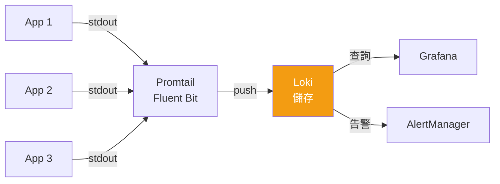
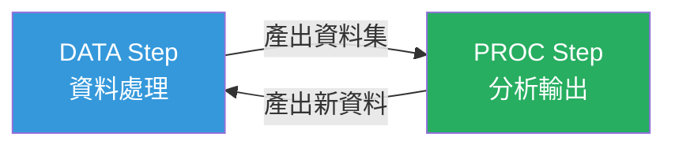
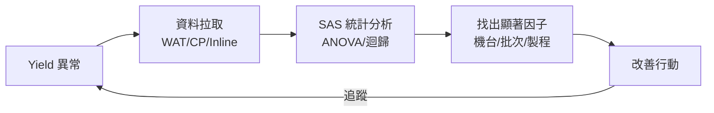

# 工具與資料分析

> [!abstract] 一句話理解
> **Go (Golang)** 是 cloud-native 時代的「系統程式語言之選」── 高效、簡潔、天生並發。**Log 分析** 是維運、品質、商業的共同放大鏡。**SAS (Statistical Analysis System)** 則是半導體與製藥業沿用數十年的統計分析平台，雖被 Python/R 部分取代，==台積電仍大量使用==。

---

## 一、Go 語言

### 1.1 Go 是什麼？為什麼 Cloud-Native 都選它？

Go 由 Google 於 2007 年開始開發、2009 年公開，設計者包括 Ken Thompson、Rob Pike、Robert Griesemer。

> [!tip] 雲原生工具的 Go 含金量
> **Docker、Kubernetes、Prometheus、Terraform、etcd、Istio、Helm、CockroachDB、InfluxDB…** 全部用 Go 寫的。==CNCF 畢業專案 70% 以上是 Go==。

### 1.2 Go 的核心優勢

| 特性 | 為什麼重要 |
|------|-----------|
| **靜態二進位** | 編譯出單一執行檔，==Docker image 可以小到 10MB== |
| **編譯快** | 大專案幾秒，rebuild 友善 |
| **GC + Goroutine** | 並發原生，寫 server 比 C++ 簡單百倍 |
| **內建工具鏈** | `go fmt`、`go test`、`go mod` 一站式 |
| **語法簡單** | 25 個關鍵字，新人 1 週上手 |
| **跨平台 cross-compile** | `GOOS=linux GOARCH=amd64 go build` 一行解決 |

### 1.3 Hello World

```go
package main

import "fmt"

func main() {
    fmt.Println("Hello, IMC!")
}
```

### 1.4 Goroutine（Go 的並發殺手鐧）

```go
package main

import (
    "fmt"
    "sync"
    "time"
)

func processWafer(id int, wg *sync.WaitGroup) {
    defer wg.Done()
    fmt.Printf("Processing wafer %d\n", id)
    time.Sleep(100 * time.Millisecond)
    fmt.Printf("Wafer %d done\n", id)
}

func main() {
    var wg sync.WaitGroup
    
    // 同時處理 1000 片晶圓
    for i := 1; i <= 1000; i++ {
        wg.Add(1)
        go processWafer(i, &wg)
    }
    
    wg.Wait()
    fmt.Println("All wafers processed")
}
```

> [!tip] Goroutine vs Thread
> Goroutine 是 ==使用者空間的 lightweight thread==，初始 stack 只有 2KB（Linux thread 是 2MB）。一個 Go 程序開 100 萬個 goroutine 是日常，OS thread 開幾千個就崩了。

### 1.5 Channel（goroutine 之間溝通）

```go
package main

import "fmt"

func main() {
    ch := make(chan int, 5) // buffered channel
    
    // Producer
    go func() {
        for i := 0; i < 10; i++ {
            ch <- i * 100
        }
        close(ch)
    }()
    
    // Consumer
    for v := range ch {
        fmt.Println("Got:", v)
    }
}
```

> [!info] Go 的並發哲學
> "Don't communicate by sharing memory; share memory by communicating."
> 用 ==channel 而非 mutex== 是 Go 的慣用法。

### 1.6 結構與介面

```go
package main

import "fmt"

// 結構
type Tool struct {
    ID     string
    Status string
    OEE    float64
}

// 方法
func (t *Tool) IsHealthy() bool {
    return t.Status == "running" && t.OEE > 0.85
}

// 介面（duck typing）
type Reporter interface {
    Report() string
}

func (t Tool) Report() string {
    return fmt.Sprintf("[%s] %s OEE=%.2f", t.ID, t.Status, t.OEE)
}

func main() {
    t := &Tool{ID: "T-001", Status: "running", OEE: 0.92}
    fmt.Println(t.Report())
    fmt.Println("Healthy:", t.IsHealthy())
}
```

### 1.7 錯誤處理（顯式風格）

```go
result, err := someOperation()
if err != nil {
    return fmt.Errorf("operation failed: %w", err)
}
// use result...
```

> [!warning] Go 的爭議點
> `if err != nil` 寫得很多，但這是 Go 的設計哲學 ── ==顯式優於隱式==，沒有 try/catch 隱藏控制流。

---

## 二、Log 分析

### 2.1 Log 的角色

> Log 是「==系統說話的方式==」，每一行都是事件、線索、證據。

三大用途：
1. **除錯**：追溯為什麼這個 request 失敗
2. **稽核**：誰在何時做了什麼操作
3. **分析**：商業 / 維運趨勢

### 2.2 Log 等級

| Level | 用途 |
|-------|------|
| TRACE | 極細節的執行流程（罕用） |
| DEBUG | 開發階段除錯 |
| INFO | 一般事件（啟動、關閉、req/res） |
| WARN | 異常但仍可運作 |
| ERROR | 失敗但程式繼續 |
| FATAL | 致命錯誤、即將退出 |

### 2.3 Structured Logging（結構化日誌）

==2026 年的標準做法== ── 不寫純文字，寫 JSON。

```go
// ❌ 傳統字串式
log.Printf("user %s logged in from %s", user, ip)

// ✅ 結構化（Go 標準函式庫 slog）
import "log/slog"

slog.Info("user logged in",
    slog.String("user", user),
    slog.String("ip", ip),
    slog.Int("session_id", sid),
)
// 輸出: {"time":"...","level":"INFO","msg":"user logged in","user":"alice","ip":"10.0.0.1","session_id":42}
```

優勢：
- 可被 ==Loki / ELK 直接索引==
- 用 `jq` 在 cli 過濾很快
- 不會被字串拼接搞亂

### 2.4 Go 主流 logger

| Logger | 特色 |
|--------|------|
| `log/slog`（標準函式庫） | Go 1.21+ 內建，2026 年首選 |
| `zap`（Uber） | 極致效能，零 allocation 路徑 |
| `logrus` | 老牌、API 友善（已淡出） |
| `zerolog` | 和 zap 拼速度 |

### 2.5 Log 收集 + 分析工具鏈



| 角色 | 工具 |
|------|------|
| **App 寫 log** | slog / zap / structlog |
| **收集 agent** | Promtail、Fluent Bit、Filebeat |
| **儲存後端** | Loki、Elasticsearch、Splunk |
| **查詢 + 視覺化** | Grafana、Kibana |
| **CLI 工具** | `grep`、`awk`、`jq`、`logcli`（Loki） |

### 2.6 LogQL 範例

```logql
# 過去 5 分鐘 fab15 服務的 ERROR
{fab="F15", level="error"} |= "exception" [5m]

# 機台 down 事件統計
sum by (tool_id) (
  count_over_time({app="tool-monitor"} |= "tool down" [1h])
)

# 提取 latency 並算 P99
{app="api"} | json | unwrap latency_ms | 
  quantile_over_time(0.99, [5m])
```

### 2.7 用 Go 寫一個 Log Parser

> 場景：分析機台 log，找出每天最常異常的機台

```go
package main

import (
    "bufio"
    "encoding/json"
    "fmt"
    "os"
    "sort"
)

type LogEntry struct {
    Time   string `json:"time"`
    Level  string `json:"level"`
    Msg    string `json:"msg"`
    ToolID string `json:"tool_id"`
}

func main() {
    f, err := os.Open("tool.log")
    if err != nil {
        fmt.Fprintln(os.Stderr, err)
        os.Exit(1)
    }
    defer f.Close()
    
    counts := make(map[string]int)
    scanner := bufio.NewScanner(f)
    
    for scanner.Scan() {
        var e LogEntry
        if err := json.Unmarshal(scanner.Bytes(), &e); err != nil {
            continue
        }
        if e.Level == "ERROR" {
            counts[e.ToolID]++
        }
    }
    
    // 排序輸出 top 10
    type kv struct {
        K string
        V int
    }
    var sorted []kv
    for k, v := range counts {
        sorted = append(sorted, kv{k, v})
    }
    sort.Slice(sorted, func(i, j int) bool {
        return sorted[i].V > sorted[j].V
    })
    
    fmt.Println("Top 10 error-prone tools:")
    for i, kv := range sorted {
        if i >= 10 {
            break
        }
        fmt.Printf("%2d. %s : %d errors\n", i+1, kv.K, kv.V)
    }
}
```

執行：

```bash
go run parser.go
# 或 cross-compile 給 fab linux server
GOOS=linux GOARCH=amd64 go build -o tool-log-parser
```

### 2.8 結合 jq 做快速 cli 分析

```bash
# 過去 1 小時錯誤排行
cat /var/log/imc/tool.log | \
  jq -c 'select(.level=="ERROR") | .tool_id' | \
  sort | uniq -c | sort -rn | head

# 統計每分鐘 ERROR 數
cat tool.log | jq -r 'select(.level=="ERROR") | .time[:16]' | \
  sort | uniq -c
```

---

## 三、Statistical Analysis System (SAS)

### 3.1 SAS 是什麼？

由 SAS Institute 於 1976 年商業化的 ==統計分析平台==。在金融、製藥、半導體沿用數十年，台積電的 ==Yield Analysis、SPC、製程實驗設計== 仍大量使用。

### 3.2 為什麼半導體業愛 SAS？

| 因素 | 說明 |
|------|------|
| **歷史包袱** | 數十年累積的 SAS macro library |
| **GxP / 法規驗證** | 製藥/醫材必須用 ==驗證過的軟體==（Validated software） |
| **SPC 內建** | 統計製程管制相關工具齊全 |
| **效能** | 處理 GB-TB 等級資料表現穩定 |
| **企業支援** | SAS Institute 提供完整服務 |

### 3.3 SAS vs R vs Python

| 比較 | SAS | R | Python |
|------|-----|---|--------|
| 商業 / 開源 | 商業（昂貴） | 開源 | 開源 |
| 語法 | DATA step + PROC | 函數導向 | 通用 |
| ML / DL | 有但弱 | 中 | ==生態最強== |
| 統計嚴謹度 | ==頂級== | 頂級 | 中 |
| 大資料 | 內建 | 中等 | pandas+大數據工具 |
| 業界趨勢 | 維持 + 緩降 | 學界仍強 | ==急升== |

### 3.4 SAS 基本語法

```sas
/* 1. 讀資料 */
DATA wafer_yield;
    INFILE 'C:\data\yield.csv' DLM=',' FIRSTOBS=2;
    INPUT lot_id $ tool_id $ yield;
RUN;

/* 2. 描述性統計 */
PROC MEANS DATA=wafer_yield;
    VAR yield;
    CLASS tool_id;
RUN;

/* 3. 變異數分析 (ANOVA) - 看不同機台 yield 是否有差 */
PROC ANOVA DATA=wafer_yield;
    CLASS tool_id;
    MODEL yield = tool_id;
RUN;

/* 4. SPC 管制圖 */
PROC SHEWHART DATA=wafer_yield;
    XCHART yield * lot_id / MU0=98 SIGMA0=1;
RUN;

/* 5. 線性迴歸 */
PROC REG DATA=wafer_yield;
    MODEL yield = temperature pressure flow_rate;
RUN;
```

### 3.5 SAS 的雙語結構



- **DATA Step**：宣告式資料處理（讀檔、清理、計算欄位）
- **PROC Step**：呼叫內建分析（統計、繪圖、報表）

### 3.6 在 TSMC 的角色與趨勢

> [!info] 現實狀況
> - **傳統 yield analysis、SPC、DOE** 仍以 SAS 為主
> - **新建的 ML / DL 模型** 改用 Python（PyTorch、scikit-learn）
> - 兩者並存，==SAS 不會死，但新東西進不來 SAS==
> - JD 沒明寫但實務上 ==熟悉 SAS 是加分項==（特別在 yield 部門）

### 3.7 學習建議（面試導向）

> [!tip] 不需要精通，但要能講
> - 知道 SAS 是什麼、為什麼還在用
> - 能說出 DATA step + PROC step 結構
> - 能對比 SAS vs Python（pandas + scipy + statsmodels）
> - 加分：知道 ==JMP==（SAS 旗下視覺化統計工具，半導體業常用）

---

## 四、半導體 / IMC 場景應用

### 4.1 Go 在 IMC 的典型角色

| 服務 | 為什麼用 Go |
|------|-----------|
| 機台 sensor 資料收集器 | 高並發 + 低延遲 + 小記憶體足跡 |
| Lot 追蹤微服務 | gRPC + 高吞吐 |
| Prometheus exporter（自家 sensor） | 與 Prometheus 生態天然契合 |
| K8s controller / operator | client-go 是 Go 函式庫 |
| Edge agent | 單一二進位、無依賴 |

### 4.2 Log 分析在晶圓廠的價值

> [!example] 場景：用 log 找出機台模式
> 過去三個月 Fab 18 蝕刻機 (Etcher) ==間歇性掉線==。
> 
> **無 log 分析**：工程師逐台抓 log、肉眼比對 → 一週無進展
> 
> **有 log 分析**：
> 1. Loki 集中所有機台 log
> 2. LogQL 查詢前後 10 分鐘的關聯事件
> 3. 發現掉線都在「下午溫度劇烈變化時」
> 4. 根因 = 溫度感測器漂移觸發保護機制
> 
> 結果從 5 天縮短到 30 分鐘。

### 4.3 SAS / 統計在 Yield 改善



實務上 **PROC GLM、PROC LOGISTIC、PROC MIXED** 是 yield engineer 每日工具。

### 4.4 三者結合的實境

> [!example] 完整場景
> 機台 sensor → ==Go 收集器== → Kafka → 兩條路：
> 1. **即時告警**：用 Go service 即時偵測，寫入 Prometheus → Grafana
> 2. **離線分析**：寫入 BigQuery/Snowflake → ==Python/SAS== 做迴歸找根因
> 
> Go 處理 ==流==、SAS/Python 處理 ==量==，搭配使用。

---

## 五、面試常考題

> [!question] Q1: 為什麼 cloud-native 都用 Go？
> 
> **答題框架**：
> 1. 靜態二進位 → container 友善
> 2. Goroutine → 高並發 server 寫起來簡單
> 3. 編譯快、語法簡單 → 工程效率
> 4. Google 出品 → K8s、gRPC 帶頭使用
> 5. 強型別 + 簡單泛型 → 維護成本低

> [!question] Q2: Goroutine 為什麼比 thread 輕量？
> 
> **答題框架**：
> 1. 使用者空間排程，不是 OS thread
> 2. 初始 stack 2KB（vs OS thread 2MB）
> 3. ==M:N 模型==：M 個 goroutine 跑在 N 個 OS thread 上
> 4. 切換成本是 OS thread 的 1/100
> 
> 加分：提 GOMAXPROCS 與 work-stealing scheduler

> [!question] Q3: 結構化日誌（structured logging）跟傳統 log 差在哪？
> 
> **答題框架**：
> 1. 機器可讀（JSON）vs 人類可讀（字串）
> 2. ==被 Loki/ELK 索引才有意義==
> 3. 不用寫脆弱的 regex 解析
> 4. 跨服務追蹤 (trace_id) 容易實作

> [!question] Q4: 你會怎麼處理 GB 等級的 log 找一個特定 pattern？
> 
> **答題框架**：
> 1. 看 log 結構：JSON 用 `jq`，純文字用 `awk/grep`
> 2. 用 ==Loki + LogQL== 查（生產環境）
> 3. 不夠就拉到 BigQuery / Snowflake 用 SQL 分析
> 4. ==重複問題==：寫成 monitoring rule，下次自動告警

> [!question] Q5: SAS 還有用嗎？為什麼半導體還在用？
> 
> **答題框架**：
> 1. 歷史包袱：數十年 macro 庫
> 2. 法規驗證：被驗證過的工具不能輕易換
> 3. 統計專業：某些分析 (PROC MIXED) 仍是 SAS 較完整
> 4. 趨勢：新工作流會用 Python，==SAS 維護而非新建==

---

## 六、面試前自我驗證清單

- [ ] 能寫一個 Go Hello World
- [ ] 能解釋 goroutine + channel 的概念
- [ ] 能用 `jq` 過濾 JSON log
- [ ] 能寫一個 LogQL 查詢
- [ ] 知道 `slog` / `zap` 至少一個
- [ ] 能說出 SAS DATA step / PROC step 區別
- [ ] 能舉一個 Go 在 IMC 的應用場景

---

## 七、關鍵字速查表

| 縮寫 / 名詞 | 全稱 | 中文 |
|------------|------|------|
| Go / Golang | - | Google 開發的程式語言 |
| Goroutine | - | Go 的輕量並發單位 |
| Channel | - | goroutine 間通訊 |
| GOMAXPROCS | - | Go runtime 使用的 OS thread 數 |
| GC | Garbage Collection | 垃圾回收 |
| slog | - | Go 1.21+ 標準結構化日誌 |
| Zap | - | Uber 開發的高效能 logger |
| Loki | - | Grafana Labs 的 log 系統 |
| LogQL | - | Loki 查詢語言 |
| Promtail | - | Loki 的官方 agent |
| ELK | Elasticsearch + Logstash + Kibana | 老牌 log stack |
| jq | - | JSON 命令列工具 |
| SAS | Statistical Analysis System | 商業統計分析平台 |
| JMP | - | SAS 旗下的視覺化統計工具 |
| ANOVA | Analysis of Variance | 變異數分析 |
| SPC | Statistical Process Control | 統計製程管制 |
| DOE | Design of Experiments | 實驗設計 |
| GxP | Good x Practice | 法規體系（GMP/GLP/GCP）|

---

## 八、延伸閱讀

### Vault 內部
- [[雲原生與微服務架構]] ── Go 跑的舞台
- [[SRE 與可觀測性]] ── log 的下游
- [[DevOps 方法論與生命週期]] ── MLOps 的工具落地
- [[TSMC IMC 面試準備]] ── 回到面試主題

### 外部資源
- [Go 官方 Tour](https://go.dev/tour/) ── 互動式入門
- [Go by Example](https://gobyexample.com/) ── 範例驅動
- [Effective Go](https://go.dev/doc/effective_go) ── 慣用法
- [Loki LogQL 文件](https://grafana.com/docs/loki/latest/logql/)
- [SAS Documentation](https://documentation.sas.com/)
- 書籍：《The Go Programming Language》Donovan & Kernighan、《Go 語言聖經》中譯版

> [!success] 學習路徑建議
> 1. **Go**：跑完 Tour of Go → 寫一個 CLI 小工具 → 寫一個 HTTP server
> 2. **Log**：把上面 server 加上 slog，部署到本地 Loki，從 Grafana 查
> 3. **SAS**：用 SAS University Edition (免費) 跑跑 ANOVA、線性迴歸
> 4. 面試前最重要：能講「Go 並發模型」與「結構化日誌的價值」
