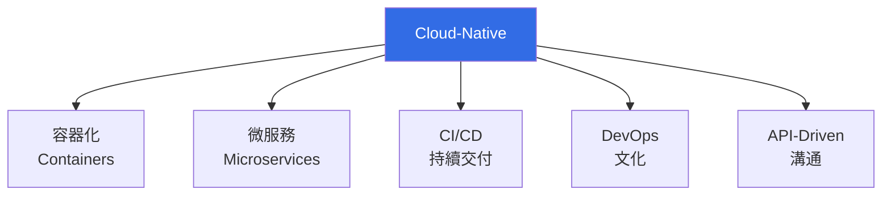
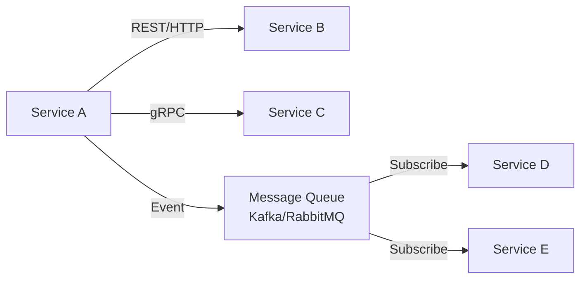
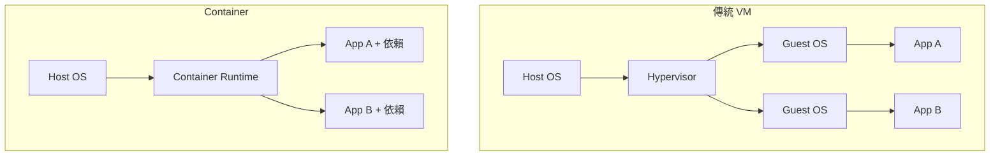
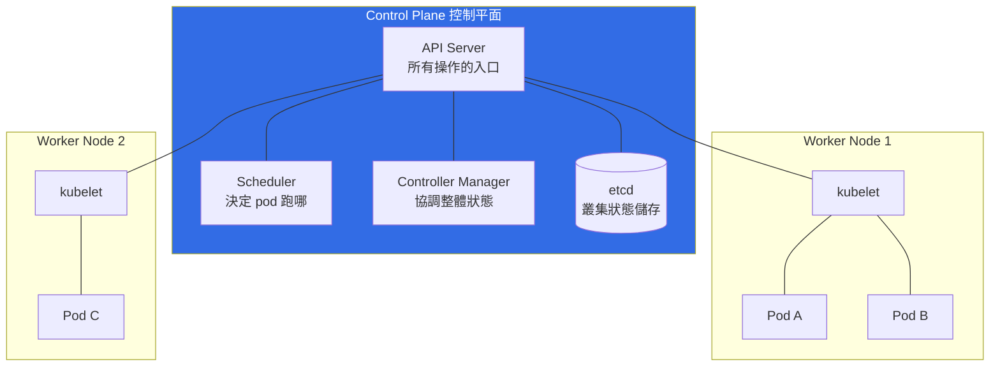

# 雲原生與微服務架構

> [!abstract] 一句話理解
> **雲原生 (Cloud-Native)** 是一種「為雲端而生」的軟體建構哲學，靠 ==容器化、微服務、自動化編排== 來打造可彈性擴展、可快速迭代、可自動修復的系統。

---

## 一、核心概念

### 1.1 什麼是 Cloud-Native？

CNCF (Cloud Native Computing Foundation) 官方定義：

> Cloud-native technologies empower organizations to build and run **scalable applications** in modern, dynamic environments such as public, private, and hybrid clouds.

簡言之，雲原生 ≠ 「跑在雲上」，而是 **設計思想** ── 系統從一開始就假設執行在「不可靠、可動態擴縮、無狀態優先」的環境。

### 1.2 雲原生五大支柱



| 支柱 | 對應技術 | 解決什麼問題 |
|------|---------|-------------|
| 容器化 | Docker / containerd | 環境一致性 (Build once, run anywhere) |
| 微服務 | gRPC / REST / 事件驅動 | 單體應用擴展瓶頸 |
| 編排 | Kubernetes | 大規模容器的自動化管理 |
| CI/CD | GitHub Actions / Jenkins | 部署速度與品質 |
| 可觀測性 | Prometheus / Grafana / Jaeger | 分散式系統的除錯難題 |

---

## 二、12-Factor App 方法論

> [!info] 背景
> 由 Heroku 工程師於 2011 年提出，是設計 SaaS / 雲端應用的 ==12 條黃金準則==。今日仍是 cloud-native 應用的入門教科書。

### 2.1 十二條原則速覽

| #   | 原則                        | 中文        | 一句話說明                                                |
| --- | ------------------------- | --------- | ---------------------------------------------------- |
| 1   | **Codebase**              | 一份程式碼     | 一個 app 對應 ==一個 git repo==，可部署多個環境                    |
| 2   | **Dependencies**          | 顯式宣告依賴    | 透過 `requirements.txt`、`go.mod` 鎖定版本，**不依賴系統預裝套件**    |
| 3   | **Config**                | 設定與程式分離   | DB 連線、API Key 一律走環境變數 (env vars)，**不寫死在程式碼**         |
| 4   | **Backing Services**      | 後端服務當資源處理 | DB、Cache、Queue 都是「可替換的附加資源」，透過 URL 連接                |
| 5   | **Build, Release, Run**   | 嚴格區分三階段   | Build (編譯) → Release (打包設定) → Run (執行)，**Release 不可變** |
| 6   | **Processes**             | 無狀態程序     | App 應為 ==stateless==，狀態存在外部服務 (DB、Redis)              |
| 7   | **Port Binding**          | 透過 port 對外 | App 自帶 web server，不依賴外部 (如 Apache)                   |
| 8   | **Concurrency**           | 透過程序水平擴展  | 用「多開 process / container」而非單機加 thread 來擴容            |
| 9   | **Disposability**         | 快速啟動與優雅關閉 | 開機 < 數秒，關機要處理完手上工作 (graceful shutdown)               |
| 10  | **Dev/Prod Parity**       | 環境一致      | 開發、測試、上線環境差異越小越好（容器化是利器）                             |
| 11  | **Logs**                  | 視 log 為事件流 | App **只寫到 stdout**，由外部系統收集 (12-factor 的精髓之一)         |
| 12  | **Admin Processes**       | 一次性管理任務   | DB migration、batch job 也用同一份程式碼跑                     |

### 2.2 為什麼這 12 條重要？

> [!tip] 對應 cloud-native 的關鍵
> - 第 3、6、11 條 → **容器化** 才有意義（pod 隨時被殺、log 必須外送）
> - 第 5、10 條 → **CI/CD** 才能高效運作
> - 第 8 條 → **Kubernetes 水平擴展** 的前提
> - 第 9 條 → **K8s rolling update / autoscaling** 才能無痛切換

### 2.3 反例：違反 12-Factor 的常見錯誤

```python
# ❌ 違反第 3 條：把密碼寫死在程式碼裡
DB_PASSWORD = "admin123"

# ✅ 正確做法
import os
DB_PASSWORD = os.environ["DB_PASSWORD"]
```

```python
# ❌ 違反第 11 條：自己寫 log file
logging.FileHandler("/var/log/app.log")

# ✅ 正確做法：寫到 stdout
logging.StreamHandler(sys.stdout)
```

---

## 三、微服務 (Microservices) vs 單體 (Monolith)

### 3.1 對照表

| 面向 | Monolith（單體） | Microservices（微服務） |
|------|----------------|----------------------|
| **部署單位** | 一整包 | 每服務獨立部署 |
| **技術棧** | 統一 | 各服務可選不同語言 (Polyglot) |
| **擴展方式** | 整個 app 一起放大 | 哪個熱就放大哪個 |
| **資料庫** | 共用一個 DB | 每服務各自一個 DB |
| **故障影響** | 一掛全掛 | 局部隔離 |
| **複雜度** | 開發簡單、運維簡單 | 開發複雜、需要可觀測性與服務治理 |
| **適合場景** | 小型團隊、業務簡單 | 大型團隊、業務複雜、需高擴展 |

### 3.2 何時不該用微服務？

> [!warning] 微服務的代價
> - **網路延遲與失敗**：所有呼叫都變網路 call
> - **資料一致性**：跨服務的 transaction 需用 Saga / 最終一致性
> - **運維複雜度爆炸**：100 個服務 = 100 個 pipeline + 100 份監控
> - **如果團隊 < 20 人，先用 ==Modular Monolith== 即可**

### 3.3 微服務間的通訊



| 模式 | 適合場景 | 例子 |
|------|---------|------|
| 同步 REST/HTTP | 前端→後端、簡單查詢 | `GET /api/wafers/{id}` |
| 同步 gRPC | 服務間高效呼叫 | 機台狀態查詢 |
| 非同步 Message Queue | 解耦、削峰、廣播事件 | 「批次完工」事件廣播給排程、品管、報表 |

---

## 四、Container 與容器化

### 4.1 為什麼需要容器？

> 「In my machine 跑得好好的」── 工程師的萬年笑話

容器把 ==程式碼 + 依賴 + 系統環境== 一起打包，徹底消除「環境不一致」的問題。



| 比較項 | VM | Container |
|--------|-----|-----------|
| 啟動時間 | 分鐘 | ==秒級甚至毫秒== |
| 大小 | GB | MB |
| 隔離性 | 強（OS 級） | 中（Process 級） |
| 資源開銷 | 高 | 低 |

### 4.2 Docker 基本指令

```bash
# 從 Dockerfile 建立 image
docker build -t my-app:v1.0 .

# 執行容器
docker run -d -p 8080:8080 --name web my-app:v1.0

# 查看執行中的容器
docker ps

# 進入容器
docker exec -it web /bin/sh

# 推送到 registry
docker push registry.tsmc.com/imc/my-app:v1.0
```

### 4.3 Dockerfile 範例（多階段建置）

```dockerfile
# Stage 1: Build
FROM golang:1.22-alpine AS builder
WORKDIR /app
COPY go.mod go.sum ./
RUN go mod download
COPY . .
RUN CGO_ENABLED=0 go build -o app ./cmd/server

# Stage 2: Runtime（極小映像）
FROM alpine:3.19
WORKDIR /app
COPY --from=builder /app/app .
EXPOSE 8080
ENTRYPOINT ["./app"]
```

> [!tip] 多階段建置的好處
> 最終映像只包含執行檔與必要的 runtime，從 ==1GB+ 壓縮到 20MB==。對於要部署到上千台機台 server 的場景，省下大量網路頻寬與啟動時間。

---

## 五、Container Orchestration（容器編排）

### 5.1 為什麼需要編排？

當容器數量從 10 個變成 10,000 個：
- 誰決定哪個容器跑在哪台機器？
- 容器掛了誰負責重啟？
- 流量增加時誰來自動擴容？
- 如何做滾動更新而不中斷服務？

==Kubernetes (K8s)== 就是答案。它是 Google 內部 Borg 系統的開源版本，已成業界事實標準。

### 5.2 Kubernetes 架構



### 5.3 K8s 核心物件

| 物件 | 用途 | 一句話 |
|------|------|--------|
| **Pod** | 最小執行單位 | 一個或多個容器的群組，共享網路與儲存 |
| **Deployment** | 管理 pod 副本 | 「我要 3 個 pod 跑這個 image」 |
| **Service** | 內部流量入口 | 給一群 pod 一個固定的 DNS / IP |
| **Ingress** | 外部流量入口 | HTTP/HTTPS 路由規則 |
| **ConfigMap** | 設定檔 | 非機密設定 |
| **Secret** | 密碼/憑證 | 加密儲存的敏感資料 |
| **PersistentVolume (PV/PVC)** | 持久化儲存 | 容器重啟後資料還在 |
| **Namespace** | 邏輯隔離 | 多租戶/多環境分離 |
| **DaemonSet** | 每節點一份 | log 收集器、節點 agent |
| **StatefulSet** | 有狀態應用 | DB、需要穩定 ID 的服務 |
| **Job / CronJob** | 一次性 / 排程任務 | DB migration、定時報表 |

### 5.4 一個完整的 K8s 範例

宣告式 YAML：「我要 3 個機台監控服務，對外開 80 port」

```yaml
# deployment.yaml
apiVersion: apps/v1
kind: Deployment
metadata:
  name: tool-monitor
  namespace: imc
  labels:
    app: tool-monitor
spec:
  replicas: 3
  selector:
    matchLabels:
      app: tool-monitor
  template:
    metadata:
      labels:
        app: tool-monitor
    spec:
      containers:
      - name: monitor
        image: registry.tsmc.com/imc/tool-monitor:v1.2.3
        ports:
        - containerPort: 8080
        env:
        - name: DB_HOST
          valueFrom:
            configMapKeyRef:
              name: tool-monitor-config
              key: db.host
        - name: DB_PASSWORD
          valueFrom:
            secretKeyRef:
              name: tool-monitor-secret
              key: db.password
        resources:
          requests:
            cpu: 100m
            memory: 128Mi
          limits:
            cpu: 500m
            memory: 512Mi
        livenessProbe:
          httpGet:
            path: /healthz
            port: 8080
          initialDelaySeconds: 10
          periodSeconds: 5
        readinessProbe:
          httpGet:
            path: /ready
            port: 8080
---
# service.yaml
apiVersion: v1
kind: Service
metadata:
  name: tool-monitor-svc
  namespace: imc
spec:
  selector:
    app: tool-monitor
  ports:
  - port: 80
    targetPort: 8080
  type: ClusterIP
```

部署：

```bash
kubectl apply -f deployment.yaml
kubectl apply -f service.yaml
kubectl get pods -n imc
kubectl logs -f deployment/tool-monitor -n imc
```

### 5.5 K8s 進階概念

> [!example]- Horizontal Pod Autoscaler (HPA)
> 根據 CPU、記憶體或自訂 metric 自動擴縮 pod 數量
> ```yaml
> apiVersion: autoscaling/v2
> kind: HorizontalPodAutoscaler
> spec:
>   minReplicas: 2
>   maxReplicas: 20
>   metrics:
>   - type: Resource
>     resource:
>       name: cpu
>       target:
>         averageUtilization: 70
> ```

> [!example]- Helm Chart（K8s 的套件管理器）
> ```bash
> helm install prometheus prometheus-community/kube-prometheus-stack
> ```
> 一個 Helm chart 內含多個 K8s 物件，方便版本化部署複雜應用。

> [!example]- Service Mesh（服務網格）
> Istio / Linkerd：把服務間通訊的「橫向關注點」（重試、熔斷、加密、追蹤）從應用程式中抽離到 sidecar proxy。**微服務數量 > 50 後值得考慮**。

---

## 六、半導體 / IMC 場景應用

### 6.1 晶圓廠 MES 系統的微服務化

傳統 MES (Manufacturing Execution System) 是巨型單體應用，==升級一次牽一髮動全身==。改造成微服務後：

| 服務 | 職責 | 技術選擇 |
|------|------|---------|
| Lot 追蹤服務 | 每片晶圓的 in/out 狀態 | Go + PostgreSQL |
| 派工排程服務 | 決定下一站機台 | Python + 自家排程引擎 |
| 機台通訊服務 | SECS/GEM 協定 | C++ + Redis |
| 量測資料收集 | sensor data ingest | Go + Kafka |
| 報表服務 | OEE、Yield 報表 | Python + ClickHouse |

### 6.2 邊緣運算 (Edge Computing) 在無塵室

> [!info] 為什麼要 Edge？
> 機台 sensor 每秒產生 ==MB 等級資料==，全部上傳到雲端會塞爆網路。Edge K8s（如 K3s、KubeEdge）部署在 Fab 內，**就地做特徵提取與初步異常判斷**，只把摘要送上雲。

### 6.3 跨廠區 K8s 多叢集架構

```mermaid
graph TB
    Hub[Central K8s<br/>控制中心]
    Hub -.--> F12[Fab 12<br/>K8s Cluster]
    Hub -.--> F15[Fab 15<br/>K8s Cluster]
    Hub -.--> F18[Fab 18<br/>K8s Cluster]
    Hub -.--> F22[Fab 22<br/>K8s Cluster]
    
    style Hub fill:#326ce5,color:#fff
```

每個 Fab 一個 K8s cluster，透過 ==Karmada / Argo CD== 做集中式部署管理。新 Fab 上線只需「複製一份 manifest」即可建好整套智慧製造平台。

---

## 七、面試常考題

> [!question] Q1: 什麼是 12-Factor App？為什麼適合 cloud-native？
> 
> **答題框架**：
> 1. 簡介起源（Heroku, 2011）
> 2. 挑 3-4 條最重要的原則：Config in env、Stateless processes、Logs to stdout、Build/Release/Run 分離
> 3. 連結到 K8s：因為 pod 是 ==短生命週期==、要能水平擴展、log 由 cluster 集中處理，所以這些原則才是 cloud-native 的前提

> [!question] Q2: Microservice 適合所有專案嗎？
> 
> **答題框架**：
> 1. 不是。代價包含網路成本、資料一致性、運維複雜度
> 2. 提出 ==Modular Monolith 先行==，等規模或團隊增長再拆
> 3. 引用 Martin Fowler 的「Monolith First」觀點加分

> [!question] Q3: K8s 的 Pod、Deployment、Service 差異？
> 
> **答題框架**：
> - Pod：最小單位，可能含多個 container，**短暫存在**
> - Deployment：管理一組 pod，提供 rolling update、replica 控制
> - Service：給一組 pod 一個穩定的網路 endpoint（pod IP 會變，service IP 不變）
> 
> 加分：說明 Service 背後是 ==kube-proxy + iptables/IPVS== 實作的 L4 負載平衡

> [!question] Q4: Container 跟 VM 的差別？
> 
> **答題框架**：
> - VM：完整 Guest OS，靠 Hypervisor 隔離，啟動慢、開銷大
> - Container：共享 Host kernel，靠 ==namespace + cgroup== 隔離，輕量
> - 實務上 Container ≠ 取代 VM，常見是 **VM 內跑 K8s，K8s 上跑 container**

> [!question] Q5: 在晶圓廠這種高可用環境，K8s 怎麼做容錯？
> 
> **答題框架**：
> 1. 多副本 (replicas) + Pod Disruption Budget
> 2. Liveness / Readiness probe 自動重啟與流量切換
> 3. 多節點 + topology spread constraints 防止單點故障
> 4. 多 cluster + GitOps（Argo CD）做災備
> 5. 強調 ==stateful 服務== 要特別處理（StatefulSet + 共享儲存）

---

## 八、面試前自我驗證清單

- [ ] 能用 30 秒解釋 cloud-native 是什麼
- [ ] 能背出至少 6 條 12-factor 原則
- [ ] 能講清楚 Pod / Deployment / Service / Ingress 的關係
- [ ] 能在白板畫出 K8s 控制平面架構
- [ ] 能寫出一個簡單的 Deployment YAML
- [ ] 能說出微服務的 3 個缺點
- [ ] 能舉一個 IMC 場景的具體應用

---

## 九、關鍵字速查表

| 縮寫 / 名詞 | 全稱 | 中文 |
|------------|------|------|
| CNCF | Cloud Native Computing Foundation | 雲原生計算基金會 |
| K8s | Kubernetes | （無，源自希臘文「舵手」） |
| Pod | - | K8s 最小執行單元 |
| HPA | Horizontal Pod Autoscaler | 水平自動擴縮 |
| VPA | Vertical Pod Autoscaler | 垂直自動擴縮 |
| CRD | Custom Resource Definition | 自訂資源定義 |
| RBAC | Role-Based Access Control | 角色為基的權限控制 |
| CNI | Container Network Interface | 容器網路介面 |
| CSI | Container Storage Interface | 容器儲存介面 |
| ETCD | - | K8s 的分散式 key-value 儲存 |
| Helm | - | K8s 套件管理器 |
| Istio | - | Service Mesh 主流實作 |
| Sidecar | - | 與主容器並存的輔助容器 |
| Operator | - | 把運維知識編碼成 K8s controller |

---

## 十、延伸閱讀

### Vault 內部
- [[SRE 與可觀測性]] ── 微服務的監控之道
- [[IaC 與自動化部署]] ── 怎麼把 K8s 集群本身管起來
- [[DevOps 方法論與生命週期]] ── 文化與流程面
- [[TSMC IMC 面試準備]] ── 回到面試主題

### 外部資源
- [12factor.net](https://12factor.net/) ── 原版 12-Factor App 文件
- [Kubernetes 官方文件](https://kubernetes.io/docs/home/)
- [CNCF Landscape](https://landscape.cncf.io/) ── 雲原生工具生態地圖
- 書籍：《Kubernetes in Action》《Designing Data-Intensive Applications》

> [!success] 學習路徑建議
> 1. **先動手** kubectl + minikube，跑起一個 hello world
> 2. **讀 12-Factor App** 原文，對照自己過去寫的 code
> 3. **看 CNCF Landscape** 知道生態系的全貌
> 4. **挑一個工具深入**：先 Prometheus 或 Argo CD 都好
