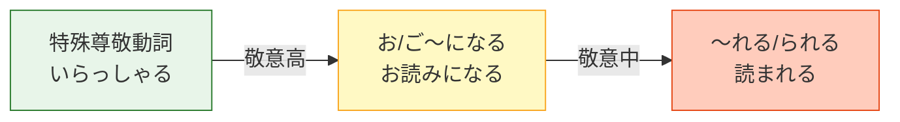

---
tags:
  - 日文
  - 日文/文法
jlpt: N3-N2
created: 2026-04-07
aliases:
  - 尊敬語
  - そんけいご
  - 尊敬表現
---

# 尊敬語

> [!info] 核心概念
> 尊敬語 = ==抬高對方的動作==。用於描述**上位者**（老師、上司、客人等）的動作。
> 總覽請見 → [[敬語總覽]]

---

## N3 基礎回顧：三大句型

### 句型一：特殊尊敬動詞

部分動詞有專屬的尊敬語形式，必須直接記憶：

| 普通形 | 尊敬語 | 意思 |
|--------|--------|------|
| 行く／来る／いる | **いらっしゃる** | 去／來／在 |
| 言う | **おっしゃる** | 說 |
| 食べる／飲む | **召し上がる**（めしあがる） | 吃／喝 |
| 見る | **ご覧になる**（ごらんになる） | 看 |
| する | **なさる** | 做 |
| くれる | **くださる** | 給（我） |
| 知っている | **ご存じだ**（ごぞんじだ） | 知道 |
| 着る | **お召しになる**（おめしになる） | 穿 |
| 寝る | **お休みになる** | 睡 |
| 死ぬ | **お亡くなりになる**（おなくなりになる） | 過世 |

> [!warning] 不規則 ます形
> 以下四個動詞的 ます形是 **r → i** 變化，不是一般的 り→ります：
>
> | 辭書形 | ます形 | ❌ 常見錯誤 |
> |--------|--------|------------|
> | いらっしゃる | いらっしゃい**ます** | ~~いらっしゃります~~ |
> | おっしゃる | おっしゃい**ます** | ~~おっしゃります~~ |
> | くださる | ください**ます** | ~~くださります~~ |
> | なさる | なさい**ます** | ~~なさります~~ |

完整動詞列表 → [[敬語動詞對照表]]

---

### 句型二：お／ご ＋ 動詞連用形 ＋ になる

沒有特殊尊敬動詞時，使用這個**萬能句型**：

**和語（訓讀）→ お～になる**
**漢語（音讀）→ ご～になる**

> [!example] 例句
> - 先生はもう**お帰りになりました**。（老師已經回去了。）
> - 社長は資料を**お読みになりました**。（社長看了資料。）
> - 部長が**ご説明になります**。（部長來說明。）

> [!tip] お vs ご 的判斷
> - **お**：日本原有的和語（訓讀），通常是單一漢字動詞 → お読み、お書き、お待ち
> - **ご**：從中國傳來的漢語（音讀），通常是兩個漢字 → ご説明、ご案内、ご連絡
> - **例外**：お電話（漢語但用お）、ごゆっくり（和語但用ご）

---

### 句型三：～れる／られる（尊敬用法）

動詞的被動形也能表示尊敬，但敬意程度**最低**：

| 動詞類型 | 變化規則 | 例 |
|----------|----------|-----|
| 五段動詞 | う段 → あ段 ＋ れる | 書く → 書か**れる** |
| 一段動詞 | 去る ＋ られる | 食べる → 食べ**られる** |
| する | される | する → **される** |
| 来る | 来られる | 来る → 来（こ）**られる** |

> [!example] 例句
> - 先生は毎朝早く**起きられます**。（老師每天早起。）
> - 社長がそう**言われました**。（社長那樣說了。）

> [!warning] 容易混淆！
> ～れる／られる 有三種意思：**被動**、**可能**、**尊敬**。
> 必須靠==上下文==判斷是哪一種。
>
> 例：先生が食べ**られた**。
> - 尊敬：老師吃了。 ✓（最常見解讀）
> - 被動：老師被吃了。（不太合理）
> - 可能：老師能吃了。（要看語境）

---

### お／ご ＋ 動詞連用形 ＋ ください

用於**尊敬地請求**對方做某事：

> [!example] 例句
> - どうぞ**お座りください**。（請坐。）
> - こちらで**お待ちください**。（請在這裡等候。）
> - **ご確認ください**。（請確認。）

---

## N2 進階句型

### お／ご～でいらっしゃる

描述對方的**狀態**，比 お～です 更尊敬：

> [!example] 例句
> - 先生は**お元気でいらっしゃいますか**。（老師您好嗎？）
> - 社長は**お忙しくていらっしゃいます**。（社長很忙。）

---

### お／ご～くださる

表示上位者**為我做某事**（＝尊敬版的 ～てくれる）：

> [!example] 例句
> - 先生が**お教えくださいました**。（老師教了我。）
> - 部長が**ご説明くださいました**。（部長為我說明了。）

> [!tip] くださる vs いただく
> 兩者翻譯都是「為我做」，但**主語不同**：
>
> | 句型 | 主語 | 敬語類型 |
> |------|------|----------|
> | 先生が**お教えくださった** | ==先生==（抬高對方） | 尊敬語 |
> | 先生に**お教えいただいた** | ==我==（降低自己） | 謙讓語I |
>
> 詳見 → [[謙讓語]]

---

## 尊敬語的敬意高低

| 排序 | 句型 | 例（読む） | 敬意程度 |
|------|------|-----------|----------|
| 1 | 特殊動詞 | — （読む 無特殊形） | ★★★ 最高 |
| 2 | お/ご～になる | **お読みになる** | ★★☆ 中等 |
| 3 | ～れる/られる | **読まれる** | ★☆☆ 最低 |

> [!tip] 考試策略
> N2 考試中，如果選項同時出現 お～になる 和 ～れる/られる，通常選**お～になる**（更正式）。但如果有**特殊動詞**，一定選特殊動詞。

---

## 相關連結

- [[敬語總覽]] — 五分類總覽
- [[謙讓語]] — 降低自己的表達
- [[敬語動詞對照表]] — 完整動詞對照
- [[敬語常見錯誤與實戰]] — 常見錯誤與練習題
