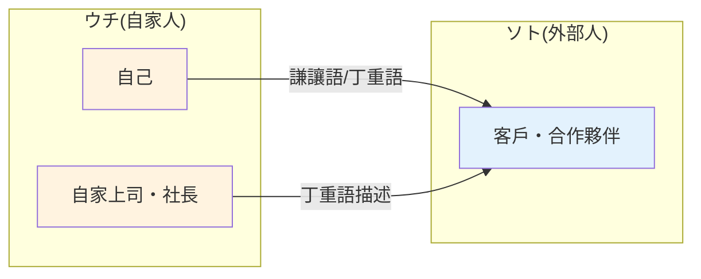

---
tags:
  - 日文
  - 日文/文法
jlpt: N2
created: 2026-04-07
aliases:
  - 敬語錯誤
  - 二重敬語
  - 敬語實戰
  - 敬語練習
---

# 敬語常見錯誤與實戰

> [!info] 本筆記定位
> 收集 N2 考試常見的敬語陷阱、實際對話範例和模擬練習題。
> 總覽請見 → [[敬語總覽]]

---

## 二重敬語（重複敬語）

**定義**：對同一個動詞重複使用兩種以上的尊敬表現。

**原則**：==一個動詞只能用一種敬語方式==。

| ❌ 錯誤（二重敬語） | ✅ 正確 | 錯誤原因 |
|---------------------|---------|----------|
| ~~お召し上がりになられる~~ | 召し上がる | 特殊動詞 ＋ お～になる ＋ ～れる，三重 |
| ~~おっしゃられる~~ | おっしゃる | 特殊動詞 ＋ ～れる |
| ~~ご覧になられる~~ | ご覧になる | ご覧になる ＋ ～れる |
| ~~お読みになられる~~ | お読みになる | お～になる ＋ ～れる |
| ~~お伺いになる~~ | 伺う | 特殊動詞 ＋ お～になる |

> [!warning] 記住這個規則
> 如果已經是**特殊敬語動詞**（いらっしゃる、おっしゃる等），就==不能==再加 お～になる 或 ～れる/られる。

> [!tip] 被接受的慣用例外
> 以下二重敬語已被廣泛接受，考試通常不會判錯：
> - **お召し上がりになる**（お ＋ 召し上がる ＋ になる）→ 慣用化 ✓
> - **お伺いする**（お ＋ 伺う ＋ する）→ 慣用化 ✓
> - **お見えになる**（お ＋ 見える ＋ になる）→ 慣用化 ✓

---

## 尊敬語 vs 謙讓語 混用錯誤

### 最常見的錯誤：把謙讓語用在對方身上

| ❌ 錯誤 | ✅ 正確 | 問題所在 |
|---------|---------|----------|
| ~~先生が参りました~~ | 先生が**いらっしゃいました** | 参る 是謙讓/丁重語，不能用在老師身上 |
| ~~お客様が申しました~~ | お客様が**おっしゃいました** | 申す 是丁重語，不能用在客人身上 |
| ~~社長が拝見しました~~ | 社長が**ご覧になりました** | 拝見 是謙讓語I，不能用在社長身上 |
| ~~先生がいただいた~~ | 先生が**召し上がった** | いただく 是謙讓，不能用在老師身上 |

> [!warning] 核心原則
> - ==尊敬語==：用於**對方**的動作 → 抬高對方 → 詳見 [[尊敬語]]
> - ==謙讓語==：用於**自己**的動作 → 降低自己 → 詳見 [[謙讓語]]
>
> 把謙讓語用在對方身上 = 把對方壓低 = ==超級失禮==

---

### ウチ・ソト 概念（內外關係）

在商業場景中，對**外部的人**提到==自家公司的人==（即使是上司），要用**謙讓語/丁重語**而非尊敬語。

> [!example] 電話場景
>
> 客戶來電找你的社長：
>
> ❌ ~~田中社長はいらっしゃいません。~~
> → 不能對外人用尊敬語稱呼自家社長
>
> ✅ 田中は只今**おりません**。
> → 對外人提到自家人用丁重語，且不加「社長」頭銜
>
> ❌ ~~田中社長は3時に戻られます。~~
> ✅ 田中は3時に**戻ります**。

> [!tip] ウチ・ソト 判斷法
> 想像一個圓圈：圈內是「我方」，圈外是「對方」。
> - 跟圈外的人說話時，圈內所有人（包含上司）都要用**謙讓/丁重語**
> - 跟圈內的人說話時，對上司用**尊敬語**
>
> ==場景變了，同一個人的敬語也要變！==

---

## させていただく 的濫用

**させていただく** 的正確條件（詳見 [[謙讓語#N2 重要句型：～させていただく]]）：
1. 有對方的許可（或可推定許可）
2. 自己從中受益

| 例句 | 判定 | 理由 |
|------|------|------|
| 本日は休ま**させていただきます** | ✅ 正確 | 有許可＋自己受益（休息） |
| 写真を撮ら**させていただけますか** | ✅ 正確 | 請求許可＋自己受益（拍照） |
| ご説明**させていただきます** | ⚠️ 過度 | 說明是工作義務，非受益 |
| 担当**させていただいております** | ⚠️ 過度 | 負責是職責，非需要許可 |
| 出席**させていただきます** | ✅ 正確 | 有被邀請（許可）＋自己受益 |

> [!tip] 更簡潔的替代
> 當 させていただく 用起來不自然時，改用 **いたします**：
> - ~~ご説明させていただきます~~ → **ご説明いたします** ✓
> - ~~担当させていただいております~~ → **担当しております** ✓

---

## N2 模擬練習題

### 第 1 題：選出正確的尊敬表達

> [!example] 問題
> 「先生、こちらの資料を（　　）ください。」
>
> A. 拝見して
> B. ご覧になって
> C. ご覧して
> D. 見られて

> [!tip]- 答案與解析（點擊展開）
> **正解：B**
>
> - A. ❌ 拝見する 是==謙讓語I==，不能用在老師身上
> - B. ✅ ご覧になる 是「見る」的==特殊尊敬語==，正確
> - C. ❌ 「ご覧する」不存在（ご覧 只能接 になる）
> - D. △ 見られる 文法正確但敬意不夠，有特殊動詞時應優先使用

---

### 第 2 題：找出錯誤的敬語

> [!example] 問題
> 以下哪一句敬語使用有誤？
>
> A. お客様がおっしゃったとおりでございます。
> B. 私は田中と申します。
> C. 先生のお宅に伺います。
> D. 社長が申された意見について報告します。

> [!tip]- 答案與解析（點擊展開）
> **正解：D**
>
> - A. ✅ おっしゃる（尊敬語）用於お客様 → 正確
> - B. ✅ 申す（丁重語）用於自我介紹 → 正確
> - C. ✅ 伺う（謙讓語I）表示自己去老師家 → 正確
> - D. ❌ 申す 是==丁重語==，用在社長身上是壓低社長。應改為「社長が**おっしゃった**意見」。
>   另外「申された」也是二重敬語（申す ＋ れる），雙重錯誤。

---

### 第 3 題：ウチ・ソト 判斷

> [!example] 問題
> 你接到客戶的電話，客戶說：「山田部長はいらっしゃいますか。」
> 你的正確回答是？
>
> A. 山田部長はいらっしゃいません。
> B. 山田部長はおりません。
> C. 山田はおりません。
> D. 山田は参りません。

> [!tip]- 答案與解析（點擊展開）
> **正解：C**
>
> - A. ❌ 對外人用尊敬語稱呼自家上司 → 錯。且保留了「部長」頭銜
> - B. ❌ 雖然用了丁重語「おる」，但==保留了「部長」頭銜== → 對外人不能加自家人的頭銜
> - C. ✅ 去掉頭銜，只稱「山田」＋ 丁重語「おりません」→ 完全正確
> - D. ❌ 参る 是「去/來」，不是「在」。「おりません」才是「不在」

---

## 實際對話範例

### 場景一：商務電話（転接電話）

> [!example] 對話
>
> **客戶（山本）**：もしもし、ABC 商事の山本と==申します==。
> → 丁重語：自我介紹用「申す」
>
> **你**：いつもお世話になって==おります==。
> → 丁重語：客套話用「おる」
>
> **客戶**：恐れ入りますが、田中部長は==いらっしゃいます==か。
> → 尊敬語：客戶用尊敬語稱呼你的上司（對客戶來說是外人的上司）
>
> **你**：申し訳ございません。田中はただいま外出して==おります==。
> → 丁重語：對外人描述自家上司，去頭銜，用丁重語
>
> **客戶**：何時ごろ==お戻りになります==か。
> → 尊敬語：詢問你上司的動作
>
> **你**：3時には戻る予定で==ございます==。戻りましたら、こちらからお電話==いたします==。
> → 丁重語 ＋ 謙讓語I：「ございます」鄭重描述、「いたす」表示自己打電話給客戶
>
> **客戶**：お手数ですが、よろしく==お願いいたします==。
> → 謙讓語I：請求對方（有明確對象）

---

### 場景二：面試自我介紹

> [!example] 對話
>
> **你**：本日は面接の機会を==いただき==、ありがとうございます。
> → 謙讓語I：從面試官那裡「收到」機會（有對象）
>
> **你**：田中太郎と==申します==。
> → 丁重語：自我介紹
>
> **你**：○○大学を卒業して==おります==。
> → 丁重語：描述自己的經歷
>
> **你**：御社のことは以前から==存じ上げて====おりました==。
> → 謙讓語I ＋ 丁重語：「存じ上げる」認識貴公司（有對象）、「おる」鄭重描述
>
> **面試官**：当社に興味を持っていただき、ありがとうございます。
> → 謙讓語I：面試官謝謝你對公司有興趣（いただく）
>
> **面試官**：自己紹介を==なさって==ください。
> → 尊敬語：面試官用尊敬語請你做自我介紹
>
> **你**：はい。それでは、自己紹介==させていただきます==。
> → 謙讓語I：得到許可 ＋ 自己受益 → させていただく 正確用法

---

## 相關連結

- [[敬語總覽]] — 五分類總覽
- [[尊敬語]] — 尊敬語句型詳解
- [[謙讓語]] — 謙讓語句型詳解
- [[敬語動詞對照表]] — 完整動詞對照
