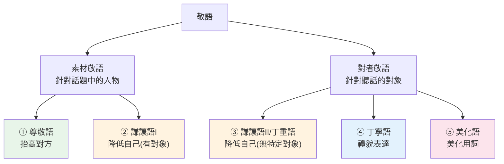
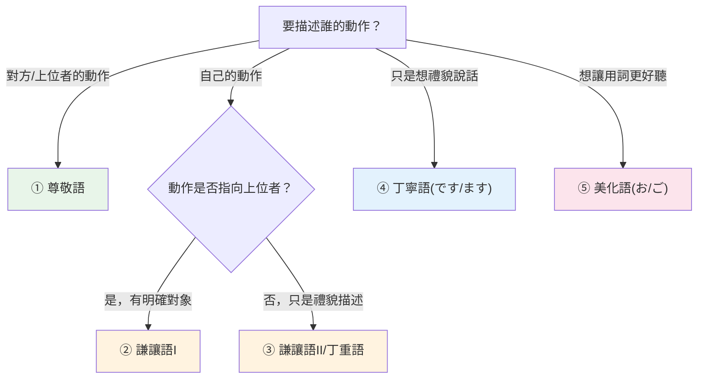

---
tags:
  - 日文
  - 日文/文法
jlpt: N3-N2
created: 2026-04-07
aliases:
  - 敬語分類
  - 敬語五分類
  - 日本語の敬語
---

# 敬語總覽

> [!info] 本系列筆記
> 涵蓋 N3 基礎回顧到 N2 進階，共 5 份互連筆記。適合 N3 基礎不穩、正在準備 N2 的學習者。

---

## 敬語的五大分類

日語敬語自 2007 年文化審議會公告後，正式分為**五類**：

| 分類 | 功能 | 對象 | 代表例 |
|------|------|------|--------|
| **① 尊敬語** | ==抬高對方==的動作 | 上位者的動作 | いらっしゃる、お～になる |
| **② 謙讓語I** | ==降低自己==（有對象） | 自己→上位者的動作 | 伺う、お～する |
| **③ 謙讓語II（丁重語）** | ==降低自己==（無特定對象） | 自己的動作（禮貌描述） | まいる、おる、申す |
| **④ 丁寧語** | 禮貌表達 | 對聽者的禮貌 | です、ます |
| **⑤ 美化語** | 美化用詞 | 讓說法更優雅 | お料理、お花、ご飯 |

> [!warning] N2 關鍵區別
> **謙讓語I** 和 **謙讓語II（丁重語）** 的區分是 N2 最常考的重點！
> 詳見 → [[謙讓語#謙讓語I vs 謙讓語II（丁重語）]]

---

## 何時用哪一種？

> [!tip] 記憶口訣
> - **尊敬語** = ==抬他==（把對方抬高）
> - **謙讓語I** = ==降己·有對象==（在 VIP 面前壓低自己）
> - **丁重語** = ==降己·無對象==（穿正裝說話，不管對誰）
> - **丁寧語** = ==禮貌==（基本的です/ます）
> - **美化語** = ==好聽==（加上お/ご讓詞彙優雅）

---

## 各主題筆記

| 筆記            | 內容                  | 重點                   |
| ------------- | ------------------- | -------------------- |
| [[尊敬語]]       | N3 三大句型 + N2 進階句型   | 特殊動詞、お/ご～になる、～れる/られる |
| [[謙讓語]]       | 謙讓語I vs 丁重語 + N2 句型 | ⭐ N2 核心區分、～させていただく   |
| [[敬語動詞對照表]]   | 22+ 動詞完整對照表         | 普通形→尊敬語→謙讓語I→丁重語     |
| [[敬語常見錯誤與實戰]] | 錯誤分析 + N2 模擬題       | 二重敬語、ウチ・ソト、實際對話      |

---

## 相關連結

- [[尊敬語]]
- [[謙讓語]]
- [[敬語動詞對照表]]
- [[敬語常見錯誤與實戰]]
