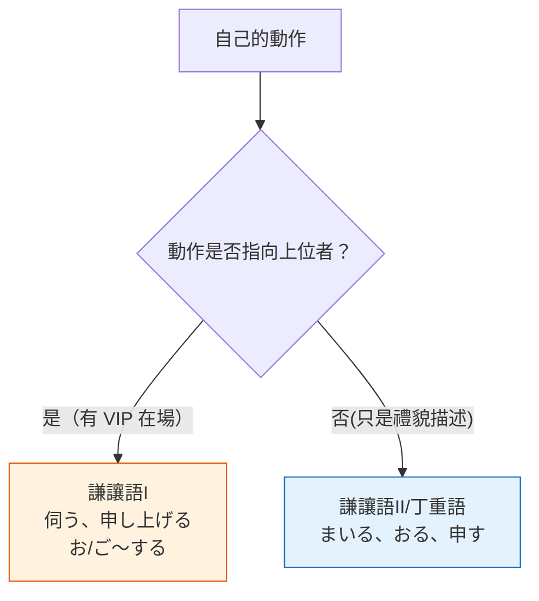

---
tags:
  - 日文
  - 日文/文法
jlpt: N3-N2
created: 2026-04-07
aliases:
  - 謙讓語
  - けんじょうご
  - 丁重語
  - ていちょうご
  - 謙遜語
---

# 謙讓語

> [!info] 核心概念
> 謙讓語 = ==降低自己的動作==。分為兩種：有明確對象的（謙讓語I）和單純禮貌描述的（丁重語）。
> 總覽請見 → [[敬語總覽]]

---

## 謙讓語I vs 謙讓語II（丁重語）

> [!warning] N2 最重要的區別
> 這是 N2 考試的**核心考點**。很多人在 N3 只學了「謙讓語」而沒有區分 I 和 II，導致在 N2 反覆出錯。

| 比較項目 | 謙讓語I | 謙讓語II（丁重語） |
|----------|---------|-------------------|
| **日文名** | 謙譲語I | 謙譲語II（丁重語） |
| **功能** | 降低自己，==抬高動作的接受者== | 降低自己，==讓說話更鄭重== |
| **是否需要對象** | ==必須有上位者作為對象== | ==不需要特定對象== |
| **記憶關鍵** | 「我對 VIP 做某事」 | 「我鄭重地做某事」 |
| **代表動詞** | 伺う、申し上げる、拝見する | まいる、おる、申す |
| **通用句型** | お/ご～する、お/ご～いたす | — |

> [!example] 對比例句：行く（去）
>
> **謙讓語I**（伺う）— 動作指向上位者：
> 明日、先生のお宅に**伺います**。（明天我去==老師==家拜訪。）
> → 「去」的對象是老師，所以用謙讓語I
>
> **丁重語**（まいる）— 只是禮貌描述自己的行為：
> 私は電車で**まいります**。（我搭電車==去==。）
> → 沒有特定的上位對象，只是鄭重地說「去」

> [!tip] 中文記憶法
> - **謙讓語I** = 🏯 ==卑躬屈膝型== — 面前一定有個 VIP，你在向他低頭
> - **丁重語** = 👔 ==正裝出席型== — 不管面前有誰，你就是穿得體面說話得體

---

## 謙讓語I

### 通用句型：お／ご～する ／ お／ご～いたす

| 句型 | 敬意程度 |
|------|----------|
| お/ご～**する** | ★★☆ 一般謙讓 |
| お/ご～**いたす** | ★★★ 更加謙遜 |

> [!example] 例句
> - お荷物を**お持ちします**。（我來拿您的行李。）
> - 会場まで**ご案内いたします**。（由我為您引導至會場。）
> - 後ほど**お電話いたします**。（稍後我會打電話給您。）

---

### 特殊謙讓語I 動詞

| 普通形 | 謙讓語I | 意思 | 記憶提示 |
|--------|---------|------|----------|
| 行く／来る | **伺う**（うかがう） | 去／來（拜訪） | ==伺==候 → 去伺候 VIP |
| 行く／来る／いる | **参る**（まいる） | 去／來／在 | ⚠️ 也是丁重語，看語境 |
| 言う | **申し上げる**（もうしあげる） | 說（對上位者） | ==申==報 → 向上申報 |
| 聞く／訪ねる | **伺う**（うかがう） | 問／拜訪 | 同「去」，一詞多義 |
| 見る | **拝見する**（はいけんする） | 看 | ==拜見== → 拜見大作 |
| 食べる／飲む／もらう | **いただく** | 吃／喝／收到 | ==頂==戴 → 頂在頭上收下 |
| あげる | **差し上げる**（さしあげる） | 給（對上位者） | ==奉==上 → 恭敬獻上 |
| 会う | **お目にかかる** | 見面 | 目にかかる → 有幸見到您 |
| 見せる | **お目にかける** | 給…看 | 目にかける → 呈給您過目 |
| 知る／知っている | **存じ上げる**（ぞんじあげる） | 知道（認識某人） | 存じ==上==げる → 向上認識 |
| 借りる | **拝借する**（はいしゃくする） | 借 | ==拜借== → 恭敬地借 |
| もらう | **頂戴する**（ちょうだいする） | 收到（更正式） | ==頂戴== → 頂在頭上 |

> [!warning] 伺う 的雙重身份
> **伺う** 同時代表「行く/来る」和「聞く/訪ねる」，必須靠上下文判斷：
> - 先生のところに**伺います**。（去老師那裡 → 行く）
> - ちょっと**伺いますが**…（請問一下 → 聞く）

---

### N2 重要句型：～させていただく

**結構**：動詞使役形（させ）＋ ていただく

**意思**：「請允許我做～」（經過對方許可後，自己受益地做某事）

> [!example] 例句
> - 本日は休ませていただきます。（今天請允許我休假。）
> - 写真を撮らせていただけますか。（可以讓我拍張照嗎？）
> - それでは、説明させていただきます。（那麼，容我來說明。）

> [!warning] 正確使用的兩個條件
> **させていただく** 的使用必須同時滿足：
> 1. ==有對方的許可==（或可以合理假設對方會同意）
> 2. ==自己從中受益==
>
> ❌ 濫用例：~~ご説明させていただきます~~（說明是工作義務，非受益）
> ✓ 正確替代：ご説明**いたします**
>
> 詳見 → [[敬語常見錯誤與實戰#させていただく 的濫用]]

---

### N2 重要句型：～ていただけませんか

**意思**：「能否請您為我做～？」（非常禮貌的請求）

**禮貌程度排序**：

| 句型 | 禮貌程度 | 場合 |
|------|----------|------|
| ～てくれる？ | ★☆☆☆ | 朋友之間 |
| ～てくれませんか | ★★☆☆ | 普通禮貌 |
| ～ていただけますか | ★★★☆ | 正式場合 |
| ～て==いただけませんか== | ★★★★ | 最禮貌（否定疑問） |

> [!example] 例句
> - この書類を確認して**いただけませんか**。（能否請您確認一下這份文件？）
> - もう少しゆっくり話して**いただけますか**。（能否請您說慢一點？）

> [!tip] 為什麼否定疑問更禮貌？
> 「いただけ==ません==か」用否定形提問，暗示「我知道這可能為難您」，給對方拒絕的空間，因此更加委婉。這和中文的「您能不能…」比「您可以…嗎」更客氣是一樣的道理。

---

## 謙讓語II（丁重語）

丁重語==不需要特定的上位對象==，只是讓自己的說法更加鄭重。常用於正式場合、演講、書面語。

### 丁重語動詞表

| 普通形 | 丁重語 | 意思 | 記憶提示 |
|--------|--------|------|----------|
| 行く／来る | **まいる** | 去／來 | ==參==拜 → 參拜神社也是「去」 |
| いる | **おる** | 在 | ==居==る → 古語「居」 |
| する | **いたす** | 做 | ==致==す → 致力於 |
| 言う | **申す**（もうす） | 說 | ==申==す → 申述 |
| 知る／知っている | **存じる**（ぞんじる） | 知道 | 存じる → 心中存有 |
| 食べる／飲む | **いただく** | 吃／喝 | ⚠️ 也是謙讓語I |
| ある | **ございます** | 有 | ござる → 古語 |
| です | **でございます** | 是 | 最鄭重的「是」 |

> [!warning] 同一動詞，兩種身份
> **いただく** 和 **参る** 可以是謙讓語I，也可以是丁重語，取決於==是否有上位對象==：
>
> | 例句 | 類型 | 判斷 |
> |------|------|------|
> | 先生に本を**いただいた** | 謙讓語I | 從==老師==那裡收到 |
> | 朝ご飯を**いただきます** | 丁重語 | 只是禮貌地說「吃」 |
> | お宅に**参ります** | 謙讓語I | 去==您的==家 |
> | 電車で**参ります** | 丁重語 | 只是禮貌地說「去」 |

> [!tip] 申し上げる vs 申す
> - **申し上げる**（謙讓語I）：對上位者說 → 先生に**申し上げます**
> - **申す**（丁重語）：鄭重地自我介紹 → 田中と**申します**（我叫田中）
>
> 「田中と申し上げます」是❌的，因為自我介紹沒有「向上位者說」的對象。

---

## 相關連結

- [[敬語總覽]] — 五分類總覽
- [[尊敬語]] — 抬高對方的表達
- [[敬語動詞對照表]] — 完整動詞對照
- [[敬語常見錯誤與實戰]] — 常見錯誤與練習題
